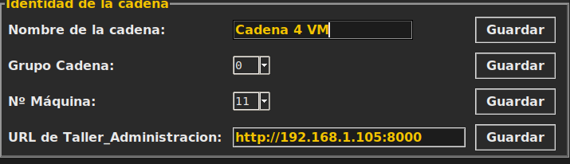

# Cómo añadir una nueva línea de producción

_Última modificación: 2026-09-29 14:38_

Guía pensada para poder seguirla sin ser programador, paso a paso, para
montar una línea de producción más (la 2ª, la 3ª..., se explica el
límite al final). Si algún término técnico no se entiende,
se explica la primera vez que aparece.

## Qué es "una línea de producción" aquí

Una **línea de producción** (o **cadena**) es un taller completo: los dos
robots, la cinta y la simulación de Webots donde se mueven. Una sola línea
ya fabrica y clasifica piezas. Tener más líneas es como tener más talleres
trabajando a la vez: cada uno fabrica por su cuenta, sin estorbar a los
demás.

Cada línea tiene **su propio panel de control**, desde el que se manejan
solo sus robots. Arriba de cada panel se ve en grande el nombre de la línea y
su Nº de máquina, para no confundirlos cuando hay varios abiertos.

Las líneas pueden estar en el mismo ordenador o en otros distintos, incluso
mezclando Windows y Linux (el 24 de septiembre de 2026 funcionaron a la vez
una línea en un PC con Windows y dos en otro equipo con Linux).

Lo importante: **todas las líneas comparten el mismo panel de
pedidos** (la web de Taller_Administracion). No hace falta duplicar
nada de eso ni configurar nada especial ahí — cada línea simplemente
avisa cuando termina una pieza, y el sistema de pedidos ya sabe
repartir el trabajo entre las líneas que haya encendidas en cada
momento (se explica cómo en el paso 5).

## Lo más fácil: ficheros que lo hacen todo

No hace falta escribir comandos largos ni tocar nada por dentro. En la
carpeta principal del proyecto hay ficheros ya preparados que lo lanzan
todo. Los `.sh` son para **Linux** (en una terminal, con `./` delante) y los
`.bat` para **Windows** (con doble clic).

| Quiero… | En Linux | En Windows |
|---|---|---|
| Arrancar todo: la web de pedidos y la primera línea, con su panel | `./arrancar_todo.sh` | `arrancar_windows.bat` |
| Añadir otra línea (la 3, la 4…), o volver a encender una que ya creé | `./crear_linea.sh 3` | `crear_linea_windows.bat` (pregunta el número de línea y el Nº de máquina) |
| Apagarlo todo | `./cerrar_todo.sh` | `cerrar_windows.bat` (cierra también las ventanas de Webots) |
| Apagar solo una línea | — | `cerrar_windows.bat 3` (apaga la línea 3 y su ventana de Webots; las demás siguen) |
| Añadir una línea sin que me pregunte nada | — | `arrancar_windows.bat 3 30`: la línea 3, con el Nº de máquina 30. El Nº se puede dejar y ponerlo luego en el panel |

Cada uno va diciendo en pantalla lo que hace, espera él solo a que los
robots estén listos y al final abre el panel de control de esa línea. En
Windows, cada línea abre su propio Webots y su panel en otra pestaña del
navegador (la 1 en `localhost:6080`, la 2 en `6081`…). Probado el 25 de
septiembre de 2026 con 4 líneas a la vez en un portátil con Windows 11.

**Una línea en otro ordenador** trabajando para la web de pedidos de este:
en el otro equipo (Linux) se añade la línea diciéndole dónde está la web,
por ejemplo `./crear_linea.sh 3 33 http://IP_DEL_OTRO:8000` (el 33 es el Nº
de máquina de esa línea, que no debe repetirse).

_Todo lo que viene a partir de aquí es para quien quiera saber qué hacen
esos ficheros por dentro, o hacerlo a mano._

## La forma rápida: un solo comando

Todo lo que explican los pasos 1 a 4 de aquí abajo —copiar la plantilla,
cambiarle los tres nombres, encenderla, lanzar la celda y esperar a que
conecten los robots— lo hace de un tirón el script `crear_linea.sh`, en la
raíz del proyecto:

```bash
./crear_linea.sh 3
```

Si se ejecuta sin ningún número, enseña esta misma ayuda en vez de arrancar
nada:

```text
Uso: crear_linea.sh <N> [numero_maquina] [url_taller_administracion] [grupo_cadena]

Ejemplos:
  crear_linea.sh 3
  crear_linea.sh 3 3
  crear_linea.sh 3 3 http://IP_DEL_PRINCIPAL:8000
  crear_linea.sh 3 3 http://IP_DEL_PRINCIPAL:8000 0
```

Cada parámetro, en el orden en que hay que escribirlos:

| Parámetro | Obligatorio | Qué es |
|---|---|---|
| `N` | Sí | El número de la línea nueva (3, 4... nunca 1 ni 2, esas ya existen). Fija también su `ROS_DOMAIN_ID` (30+N). |
| `numero_maquina` | No | 0 a 99. El Nº Máquina de esa línea en el panel — si no se pasa, no se toca (se rellena luego a mano en la pestaña Configuración). |
| `url_taller_administracion` | No | Solo hace falta si esa línea vive en **otro ordenador** distinto del que tiene Taller_Administracion. P. ej. `http://IP_DEL_PRINCIPAL:8000`. |
| `grupo_cadena` | No | 0 a 99. El Grupo Cadena de esa línea — igual que el Nº Máquina, si no se pasa se deja para rellenar luego a mano. |

Al terminar, abre él solo el panel de control. Y si la línea ya existía —la
creaste otro día y solo quieres volver a encenderla— el script se da cuenta
solo: no toca la plantilla ni los nombres, simplemente la enciende y la lanza
tal cual estaba.

Los pasos 1 a 4 de aquí abajo explican, uno por uno, qué hace el script por
dentro — léelos si prefieres hacerlo a mano, o si quieres entender cada pieza
antes de usarlo.

## 1. Copiar la plantilla ya hecha

Dentro de la carpeta `Lab.Panda 2.4` hay una carpeta llamada
`.devcontainer2` que es justo esto: la "receta" de cómo montar una
segunda línea, ya escrita y ya probada. Para crear la línea número N,
se copia entera con otro nombre:

```bash
cp -r "Lab.Panda 2.4/.devcontainer2" "Lab.Panda 2.4/.devcontainerN"
```

(sustituir la N por el número real, por ejemplo `.devcontainer3`).

## 2. Abrir esa copia y cambiar solo tres cosas

Dentro de la carpeta nueva hay un fichero llamado `docker-compose.yml`
— es la "receta" en sí, dice qué cajas hay que encender y cómo. Hay que
abrirlo con un editor de texto normal y cambiar únicamente estas tres
cosas (aparecen dos veces cada una, una por cada caja):

1. **El nombre de las cajas** (`container_name` y `hostname` en el
   fichero): tienen que llevar el número de línea, por ejemplo
   `webots_panda_sim24_linea3` y `ros2_panda_dev24_linea3`. Dos cajas
   nunca pueden tener el mismo nombre en el mismo ordenador, así que
   esto es obligatorio.
2. **El nombre de la red** (`panda_ros_net_lineaN` en el fichero): cada
   línea necesita su propia red interna para que los robots de una
   línea no "escuchen por error" a los de otra.
3. **El número de "dominio"** (`ROS_DOMAIN_ID` en el fichero): es el
   número que de verdad mantiene cada línea aislada de las demás —
   como si cada línea hablara en un canal de radio distinto y no
   pudiera oír a las otras aunque estén en la misma sala. Cada línea
   necesita un número que ninguna otra esté usando ya (la línea 1 usa
   uno, la línea 2 usa el `32`; la siguiente podría ser el `33`, etc.).

Todo lo demás del fichero se deja tal cual está copiado — apunta a
propósito a las mismas carpetas de código que la línea 1 (para no
tener que mantener copias sueltas del mismo taller: si se mejora algo
en el código, todas las líneas lo tienen a la vez).

**Un aviso sobre los "puertos"** (la forma en que una caja habla con el
mundo exterior, como el botón físico de parada de una Raspberry Pi
Pico): si esta línea nueva tiene su propio botón físico conectado, hay
que darle un puerto que ninguna otra línea esté usando. Si es solo
simulación (sin hardware físico propio, como la línea 2 de pruebas), se
deja sin esa parte — usar el mismo puerto que otra línea hace que el
arranque falle directamente, con un aviso claro de qué puerto choca.

## 3. Encender la línea nueva

Desde un terminal, dentro de la carpeta que se acaba de crear:

```bash
cd "Lab.Panda 2.4/.devcontainerN"
docker compose up -d --build
```

Esto tarda un rato la primera vez (está preparando las cajas). Cuando
termina, la línea ya está funcionando por dentro, aunque todavía no se
ve ninguna ventana en pantalla — eso es el siguiente paso.

> **El código de ROS2 (`ros2_ws`) es el mismo para todas las líneas de esta
> máquina**, así que solo hay que compilarlo una vez, no una por línea. Si
> esta es la **primera** línea que se enciende en este ordenador (nunca se
> pasó antes por `arrancar_todo.sh`), hay que compilarlo a mano antes del
> siguiente paso — si no, falla con `setup.bash: No such file or directory`:
>
> ```bash
> docker exec ros2_panda_dev24_lineaN bash -c "source /opt/ros/humble/setup.bash && cd /workspace && colcon build --packages-select panda_controller --symlink-install"
> ```

## 4. Poner en marcha los robots de esa línea

Encender las cajas no mueve todavía nada: hay que arrancar dentro el
programa que conecta los robots con Webots (se queda funcionando en
segundo plano):

```bash
docker exec -d ros2_panda_dev24_lineaN bash -c "source /opt/ros/humble/setup.bash && source /workspace/install/setup.bash && cd /workspace && ros2 launch panda_controller robot_launch_industrial_cell.py > /tmp/robot_launch.log 2>&1"
```

Para saber si ya ha conectado, esto tiene que acabar diciendo `6`
(los seis "controladores": dos brazos, dos cámaras y dos supervisores):

```bash
docker exec ros2_panda_dev24_lineaN grep -c "Controller successfully connected" /tmp/robot_launch.log
```

## 5. Abrir el panel de control de esa línea y configurarla

```bash
docker exec -it ros2_panda_dev24_lineaN bash
source /opt/ros/humble/setup.bash && source /workspace/install/setup.bash
ros2 run panda_controller teleop_gui
```

Esto abre la ventana del panel de control, igual que la de la línea 1
pero para esta línea nueva. Todo lo que hay que rellenar está en la
pestaña **Configuración**: pulsa *Desbloquear (clave)* y escribe la clave
maestra `1111` (así nadie lo cambia sin querer; la pestaña se vuelve a
bloquear sola al cambiar de pestaña; esa clave se puede cambiar en la propia
pestaña, en el recuadro *Cambiar clave de configuración* que hay debajo de *Idioma*, escribiéndola dos veces):

- **"Nombre de la cadena"**: un texto libre, por ejemplo "Línea 3" —
  sirve para distinguir de un vistazo qué ventana es cuál cuando hay
  varias abiertas a la vez. Se ve en grande arriba del panel, en el
  título de la ventana y **en un letrero dentro de su Webots**.
- **"Grupo Cadena"** (0 a 99): qué familia de productos fabrica esta
  línea. Cada producto de la web tiene también su "Grupo cadena", y sus
  pedidos nuevos solo los ven las líneas de ese grupo. Ejemplo: al producto
  *Clavos* le ponemos grupo **80**, y a una línea le ponemos también grupo
  **80**: esa línea fabrica **solo clavos** e ignora el resto de productos,
  y los clavos no los fabrica ninguna línea de otro grupo. Con 0, la línea
  coge los productos que no tienen grupo.
- **"Nº Máquina"** (0 a 99): un número que ninguna otra línea esté
  usando ya. Cuando una línea coge un pedido, el pedido pasa a llevar
  este número y las demás dejan de verlo, así que nunca se duplica el
  mismo trabajo por accidente. No uses 0: significa "pedido libre" y con
  él la línea no podrá coger pedidos.
- **Raspberry Pi Pico**: márcalas solo en la línea que las tenga
  conectadas (normalmente la 1). Cada Pico solo puede obedecer a una
  línea a la vez; el panel se encarga de que no se crucen.
- **"URL de Taller_Administracion"**: déjalo vacío si esta línea vive en el
  mismo ordenador que la web de pedidos (el caso normal). Solo hace falta
  rellenarlo si esta línea se lanza en **otro ordenador** de la red — ver el
  apartado siguiente.

> **Buena práctica: reserva los números.** El grupo y el número de máquina
> **comparten el mismo campo del pedido** (0 a 99), así que **no deben
> coincidir**: si una línea tiene el Nº Máquina 80 y los clavos son del grupo
> 80, esa línea se creería dueña de los pedidos de clavos aunque no sea de su
> grupo. Lo más fácil es repartir la numeración desde el principio y no
> mezclarla, por ejemplo **máquinas del 1 al 49 y grupos del 50 al 99**
> (clavos = grupo 80). Nada lo obliga por sistema: es una costumbre que
> conviene tener antes de tener muchas líneas.

Cada apartado tiene su botón *Guardar* (o *Aplicar*, en las Pico).

## ¿Se puede lanzar una línea en otro ordenador físico?

Sí. Cada línea (su Webots y sus robots) es totalmente independiente y no
necesita nada de otro ordenador. Lo único que sí es compartido es la web de
pedidos (Taller_Administracion) — normalmente vive en el mismo PC que la
línea 1, y las demás líneas la encuentran solas por un nombre interno que solo
funciona dentro de esa misma máquina. Para que una línea en **otro** ordenador
la encuentre, hay que decirle la dirección de red real:

1. En el ordenador donde vive la web, mira su IP en la red local (por
   ejemplo con `hostname -I` o `ip addr`) — algo como `IP_DEL_PRINCIPAL`.
2. En el panel de la línea nueva, pestaña **Configuración**, campo **"URL de
   Taller_Administracion"**: escribe `http://IP_DEL_PRINCIPAL:8000` (esa IP,
   puerto 8000) y pulsa *Guardar*. El panel se reconecta solo, sin reiniciar
   nada.
3. Comprueba que el cortafuegos del ordenador de la web deja pasar ese
   puerto 8000 desde la red local (el contenedor ya lo publica en todas las
   interfaces).



_Ejemplo real: una línea que vive en otro ordenador (una máquina virtual
llamada «Cadena 4 VM», Nº Máquina 11) apuntando con la URL de
Taller_Administracion a la web de pedidos, que está en otro PC de la red._

> La Raspberry Pi Pico de esa línea (si tiene) tiene que estar conectada
> físicamente al ordenador donde corre **esa** línea, no al de la web de
> pedidos. El resto — Grupo Cadena, Nº Máquina, arrancar/apagar — funciona
> exactamente igual que si estuviera en el mismo ordenador.

## 6. Apagar una línea cuando no se necesite

```bash
cd "Lab.Panda 2.4/.devcontainerN"
docker compose down
```

Esto apaga y borra las cajas de esa línea, pero no borra nada de
código ni de la base de datos de pedidos — se puede volver a encender
en cualquier momento repitiendo el paso 3. Si esa línea se quedó con
algún pedido "suyo" a medias, ese pedido se queda reservado para ella
hasta que alguien lo libere a mano (hay un botón "Liberar" en la web de
pedidos, para quien tenga permiso de administrador del sistema).

## Cuántas líneas caben

El panel de control deja elegir Nº Máquina y Grupo Cadena del 0 al 99,
así que por numeración sobra sitio. El límite real es el ordenador:
cada línea es un Webots completo más sus robots, y con dos ya se nota
el trabajo de la máquina. Si algún día hiciera falta ampliar los
números, están en `MAX_MAQUINA` / `MAX_GRUPO_CADENA` (`teleop_gui.py`) y
`GRUPO_CADENA_MAX` (`Taller_Administracion/app/main.py`); el resto de
este proceso (los pasos 1 a 6) sería exactamente igual.

Ver también cómo están montadas las Raspberry Pi Pico y el porqué de este
diseño (una réplica de contenedores aislada, no una segunda celda en el mismo
Webots) en [analisis_ampliacion_taller.md](analisis_ampliacion_taller.md).
