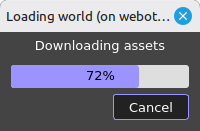

_Última modificación: 2026-09-21 20:55_

# Arrancar el proyecto

Todos los `cd` de aquí abajo son **relativos a la carpeta del proyecto**
(donde tengas clonado o copiado `virtual-robotic`, o `Robotica` si es tu
propia copia). Sitúate ahí primero:

```bash
cd virtual-robotic   # o la carpeta donde lo tengas tu
```

**Atajo:** `./arrancar_todo.sh` hace de un tirón los pasos de la Parte A
y B de aquí abajo (sin las Pico físicas) y termina abriendo el panel de
control manual. Necesita sesión gráfica local (no vale por SSH puro) y
`xhost`.

**La primera vez, mejor NO uses el atajo — arranca a mano, paso a paso
(Parte A y B de aquí abajo).** No es que el script esté roto: es que la
primera construcción de la imagen de Webots descarga un paquete grande
(el propio Webots) y **puede parecer colgada mucho rato alrededor del
70-80%** — sin ver los pasos por separado es fácil pensar que algo ha
fallado y cortarlo a media construcción (que sí deja el build a
medias de verdad). Yendo a mano ves exactamente en qué paso se para y
cuánto tarda cada uno; una vez que sabes que en tu máquina/VM funciona,
ya usa `./arrancar_todo.sh` tranquilo para las siguientes veces, que
reaprovecha todo lo ya construido y va rápido.



Esto es justo lo que vas a ver: una ventana de Webots con "Downloading
assets" parada en algún punto entre el 70 y el 90% durante un buen rato.
**No le des a Cancel.**

**Por qué solo pasa "la primera vez":** Docker cachea cada paso de la
construcción de la imagen. La descarga del paquete de Webots es un paso
que, una vez se completa con éxito una sola vez, queda en caché — la
siguiente construcción de esa misma imagen se lo salta entero y pasa
por el 70-80% volando. No hace falta que sea literalmente tu primera
vez arrancando el proyecto: es la primera vez que esa imagen en
concreto se construye en esa máquina (si borras el clon y vuelves a
clonar, o haces `docker system prune`, vuelve a tocar esperar ahí).

**Si `arrancar_todo.sh` no funciona a la primera** (el panel de control
no llega a abrirse, o los controladores no conectan pese al reintento
automático), lo más simple y que mejor funciona en la práctica es
`./cerrar_todo.sh` seguido otra vez de `./arrancar_todo.sh` — visto en
vivo que la segunda vuelta arranca bien aunque la primera no. No tenemos
localizada la causa exacta de por qué falla a veces la primera vez tras
un arranque en frío, así que de momento esta es la receta que funciona,
no una explicación completa.

Si aun así el script te falla o se ve raro, o simplemente quieres los
comandos sueltos, sigue leyendo — es la misma secuencia que hace el
script, explicada paso a paso.

Hay **dos proyectos independientes** que se hablan por red (HTTP), no
comparten código ni contenedores:

1. **`Lab.Panda 2.4`** — la simulación (Webots + ROS 2): dos brazos Panda
   (Loader y Sorter) que mueven cubos por una cinta y los clasifican por
   color, más dos Raspberry Pi Pico con un LED RGB real cada una.
2. **`Taller_Administracion`** — servidor web (FastAPI + SQLite) de
   pedidos y almacén. Se entera de lo que fabrica el robot por HTTP; si
   está apagado, la simulación sigue funcionando igual, solo que nadie
   apunta la producción en ningún pedido.

Puedes arrancar solo el que necesites. Si vas a hacer producción de
verdad (que los pedidos se completen solos), hacen falta los dos.

## Los 3 contenedores Docker de todo el proyecto

| Contenedor | De qué proyecto | Qué es |
|---|---|---|
| `webots_panda_sim24` | Lab.Panda 2.4 | La simulación 3D (Webots) |
| `ros2_panda_dev24` | Lab.Panda 2.4 | ROS 2 y todos los nodos Python (brazos, cámaras, LEDs, panel de control) |
| `taller_admin_api` | Taller_Administracion | Servidor web de pedidos/almacén |

Compruébalo con `docker ps`. **Si ves otros nombres** (`ros2_dev`,
`webots_sim`, o los mismos sin el `24` al final) son restos de un
proyecto antiguo ya borrado (`Lab.Panda 2.3`) — párralos y bórralos antes
de seguir: `docker stop <nombre> && docker rm <nombre>`.

---

## Parte A — Taller_Administracion (lo más simple, sin Webots)

```bash
cd Taller_Administracion
docker compose up -d --build
```

Abre **http://localhost:8000**: sale la web de presentación "Virtual
Robotic" (misma que `Virtual_Robotic/index.html`, pero servida de verdad
por esta app). Pulsa "Entrar" con usuario de arranque `admin` / `admin` y
pasas directo al sistema real en `/panel` -- login único, no hay que
volver a entrar ahí.

Cualquier usuario `normal` que se cree también entra con la contraseña
maestra `1111` (pensada para dejar que alguien "juegue" sin darle una
cuenta); para `admin_sistema`/`admin_cliente` la maestra solo cuela con
`TALLER_DEV_MODE=true` (ya activo en el `docker-compose.yml` de este
proyecto).

**La primera vez que arranca contra una base de datos vacía**, el propio
servidor siembra datos de ejemplo para no empezar de cero del todo:
7 colores de LED, 3 productos (Tornillos/Tuercas/Arandelas) con sus
variantes y 2 paquetes, y 3 empresas de ejemplo (Ferretería Ereño,
Suministros Mungia, Construcciones Busturia) con usuarios ya en
distintas sucursales y su catálogo asignado — con la maestra `1111`
puedes entrar como cualquiera de ellos y hacer pedidos de verdad sin
dar de alta nada a mano. Si `data/taller.db` ya existía de antes
(volumen reutilizado), este sembrado no se repite ni pisa nada.

**Para verlo desde el móvil** (misma Wi-Fi que este ordenador): usa la IP
local de este PC en vez de `localhost` —
```bash
hostname -I   # coge la que empiece por 192.168.x.x
```
y entra en `http://<esa_ip>:8000`.

Apagar: `docker compose down` en esta misma carpeta.

---

## Parte B — Lab.Panda 2.4 (la simulación)

### 0. Encender las dos Raspberry Pi Pico (antes de nada)

**No es necesario** — son hardware físico opcional, ver "Cómo está
hecho" más arriba. Si no las tienes o no las conectas, la celda
funciona exactamente igual, solo que sin el LED real, el botón físico
de parada ni la pantalla. Toda la información de cómo están montadas
(pines, cableado, resistencias, firmware) está en
[Documentacion/PI_PICO_montaje.html](Documentacion/PI_PICO_montaje.html),
y el esquema específico de la pantalla OLED del Loader (qué muestra el
producto en curso) en
[Documentacion/PI_PICO_cableado_oled.html](Documentacion/PI_PICO_cableado_oled.html).

### Tu Wi-Fi: las claves de la Pico W (léelo antes de tocar la Pico)

La Pico W del Sorter necesita entrar en tu Wi-Fi, y para eso hay dos ficheros en
`Rasberry_Pi_Pico/`. **En el repositorio son solo plantillas**, sin las claves de nadie:

| Fichero | Qué hay que poner |
|---|---|
| `wifi_config.py` | `SSID` (el nombre de tu Wi-Fi), `PASSWORD` (su clave) y `PC_IP` (la IP de **este ordenador** en la red; sale con `hostname -I`) |
| `webrepl_cfg.py` | `PASS`: una clave cualquiera para acceder a la Pico por WebREPL |

1. Edita los dos ficheros con tus datos y copialos a la Pico (Thonny → *Guardar como…* → dispositivo).
2. **Para que Git no te suba tus claves por accidente**, dile que se olvide de esos cambios:
   ```bash
   git update-index --skip-worktree Rasberry_Pi_Pico/wifi_config.py Rasberry_Pi_Pico/webrepl_cfg.py
   ```
   Desde entonces esos dos ficheros no salen como modificados, aunque tengan tus claves. Si algún día
   quieres cambiar la plantilla *de verdad*: `--no-skip-worktree`, cambia, commitea y vuelve a marcarlos
   (guardando antes tus claves aparte).
3. **Nunca subas las claves reales.** Si se cuelan en un commit, cambia la contraseña de tu Wi-Fi: borrar
   el commit después no basta si alguien ya lo copió.
4. Si el router le cambia la IP a tu ordenador, actualiza `PC_IP`: si no, el botón de parada de la Pico
   deja de avisar al robot.

La Pico del Loader va por USB y **no necesita Wi-Fi**.

Hay una Pico por robot, cada una con su propio LED:

- **Sorter → Pico W de siempre** (`Rasberry_Pi_Pico/`, por Wi-Fi). Dale
  corriente; `main.py` arranca solo y se conecta al Wi-Fi, quedando a la
  escucha en `192.168.1.101:5001`. Es también la que lleva el **botón
  físico de parada de emergencia** (ver más abajo).
- **Loader → Pico nueva sin Wi-Fi** (`Rasberry_Pi_Pico_USB_Loader/`).
  Conéctala por USB a este ordenador (el `docker-compose.yml` ya sabe
  encontrarla sola por su ruta estable de `/dev/serial/by-id/`, no hace
  falta tocar nada salvo que la sustituyas por otra Pico distinta).

### 1. Autorizar pantalla y levantar los 2 contenedores de la simulación

```bash
xhost +local:docker
```
Necesario para que Webots (y cualquier ventana gráfica lanzada dentro del
contenedor) pueda dibujar en tu pantalla.

```bash
cd "Lab.Panda 2.4/.devcontainer"
docker compose up -d --build
```
**La primera vez tarda de verdad, y puede parecer colgado alrededor del
70-80% del progreso** — ahí es donde se descarga el paquete de Webots en
sí (pesa bastante) desde el repo de Cyberbotics; según la red puede
tardar varios minutos sin que sea un fallo. El `-d` solo afecta a cuando
los contenedores ya están construidos y arrancan — mientras se
**construye** la imagen, la terminal se queda mostrando el progreso y
hay que dejarla abierta hasta que termine. Si la cierras a media
construcción (con la X, o Ctrl+C), el build se corta y hay que
repetirlo: no rompe nada permanente, pero antes de reintentar comprueba
que no quedó nada a medias con `docker ps -a` y, si hay algo del
proyecto, `docker compose down` antes de relanzar.

Si el contenedor `webots` falla al arrancar quejándose de `/dev/dri`
(no hay GPU/aceleración 3D en esa máquina, típico en una VM sin
aceleración habilitada), comenta la línea `- /dev/dri:/dev/dri` del
`devices:` de `webots` en este `docker-compose.yml` — Webots cae a
renderizado por software, más lento pero funciona. La Pico USB del
Loader (`ros2_app`) ya NO da este problema: por defecto (sin Pico
conectada, o en una máquina que nunca la ha tenido, como una VM) el
contenedor arranca igual, sin que haga falta tocar nada — ver el
comentario del bloque `devices:` de `ros2_app` en el propio fichero
si quieres activar esa Pico en una máquina que sí la tenga.

Esto crea/arranca `webots_panda_sim24` (carga directamente el mundo
`worlds/panda_industrial_cell.wbt`, la celda de dos robots) y
`ros2_panda_dev24`. Compruébalo con `docker ps`.

### 2. Compilar el paquete

**Obligatorio la primera vez** (clon nuevo, o si has borrado
`ros2_ws/install/`): ese directorio son artefactos regenerables y está
en `.gitignore` a propósito, así que un `git clone` no lo trae — sin
este paso, el `ros2 launch` del paso 3 falla porque el paquete no existe
todavía. Las veces siguientes, solo hace falta si has tocado código
Python.

```bash
docker exec -it ros2_panda_dev24 bash
cd /workspace
colcon build --packages-select panda_controller --symlink-install
```

### 3. Lanzar la celda completa (deja esta terminal abierta)

```bash
docker exec -it ros2_panda_dev24 bash
cd /workspace
ros2 launch panda_controller robot_launch_industrial_cell.py
```
Esto conecta de golpe los 6 "controladores" de la celda: el brazo
Loader, el brazo Sorter, las dos cámaras cenitales (una sobre la caja del
Loader, otra sobre el punto de recogida del Sorter), el
`WarehouseSupervisor` (un robot invisible que vigila la posición real de
los 3 cubos: rescata los que se caen y recicla los ya clasificados de
vuelta a la caja) y el `SorterShuttleSupervisor` (sesión 2026-09-10,
sin cuerpo físico igual que el anterior: la "bandeja" que centra en X y
gira el cubo que llega al punto de recogida del Sorter, para que no
aterrice descentrado — ver `Documentacion/carriles_completo.html`).
**Espera a ver 6 veces** `Controller successfully connected` en el log
antes de seguir.

**Si tras ~60 segundos no ha conectado ninguno** (visto en vivo varias
veces, sobre todo en una máquina/VM nueva arrancando Webots en frío por
primera vez): no hace falta ir directo al "si algo se atasca" de más
abajo ni repetir todo desde el paso 1. Lo más rápido, y lo que hace
`arrancar_todo.sh` automáticamente:
```bash
docker restart webots_panda_sim24
```
Espera unos 20 segundos a que Webots vuelva a cargar el mundo y repite
este mismo paso 3 (`ros2 launch ...`) — la segunda vez conecta bien
casi siempre. Si sigue sin conectar tras eso, mira
`docker exec ros2_panda_dev24 cat /tmp/robot_launch.log` (si lanzaste
en segundo plano) o el propio error de esta terminal.

**Esta terminal se queda abierta mientras trabajes.** Si la cierras (o
el propio comando se para por lo que sea), este paso deja de estar
"hecho" aunque los contenedores del paso 1 sigan arriba — y **nada** de
lo de abajo (LEDs, panel, producción) va a funcionar hasta que lo
relances. Para comprobar si ya lo tienes corriendo en OTRA terminal antes
de lanzarlo otra vez:
```bash
docker exec ros2_panda_dev24 bash -c "ps -ef | grep robot_launch_industrial_cell | grep -v grep"
```
Si no sale nada, no está corriendo — hazlo ahora antes de seguir con el
paso 4 o el 5.

### 4. Puentes de LED (uno por robot, cada uno en su terminal)

**No es necesario si no tienes las Raspberry Pi Pico** (ver paso 0, más
arriba): sin ellas no hay nada real a lo que reenviar el color, así que
simplemente no lo lances — la celda funciona exactamente igual, solo
que sin el LED físico. Tampoco hace falta para el panel de control
(paso 5): su pestaña **Raspberry Pi Pico** simula el color de los 3 LED
escuchando los mismos topics ROS, sin depender de que este puente (ni
la Pico) exista de verdad.

**Más fácil desde el 2026-09-14:** en el panel de control (paso 5),
pestaña **Configuración** → *Desbloquear (clave)* → marca las Pico que
usa esta cadena → *Aplicar configuración de las Pico*. El panel arranca
los puentes solo (y los vuelve a arrancar en cada arranque del panel), y
si tienes dos cadenas se asegura de que cada Pico obedezca solo a una.
Los comandos manuales de abajo siguen valiendo si no usas el panel.

> **La clave de la pestaña Configuración se puede cambiar** (2026-09-21): en la propia pestaña, ya
> desbloqueada, hay un recuadro *Cambiar clave de configuración* justo debajo de **Idioma**. Escribes la clave
> nueva **dos veces**; solo se guarda si coinciden y tienen al menos 4 caracteres. Cada línea tiene la
> suya, se guarda cifrada (nunca en claro) y no se pierde al reiniciar. Si se olvida, se borra la
> entrada `clave_config` del fichero `config_maquina_*.json` de esa línea (en `ros2_ws/`) y vuelve la
> `1111` de fábrica.
>
> **Restablecerla con el botón** (2026-09-21): con la pestaña *Configuración* o *Raspberry Pi Pico* abierta,
> mantén pulsado **10 s** el botón de la Pico USB del Loader (o uno de los botones rojos simulados de la
> pestaña Pico; muestran una cuenta atrás). El panel pregunta y, al confirmar, vuelve la `1111` y la OLED
> pone *Contrasena reseteada* unos segundos. Hay que **reflashear `Rasberry_Pi_Pico_USB_Loader/main.py`**
> en esa Pico con Thonny (Guardar como → dispositivo) y **relanzar `led_publisher_usb`** para que valga.

```bash
docker exec -it ros2_panda_dev24 bash
ros2 run panda_controller led_publisher       # Sorter, habla con la Pico por Wi-Fi
```
```bash
docker exec -it ros2_panda_dev24 bash
ros2 run panda_controller led_publisher_usb   # Loader, habla con la Pico por USB
```
Cada uno reenvía lo que le llega por su topic ROS (`/comando_led` para el
Sorter, `/comando_led_loader` para el Loader) al hardware real. Sin esto
el robot se sigue moviendo igual, solo que el LED físico no reacciona.

### 5. Panel de control manual (el sitio desde el que se maneja todo)

**Necesita el paso 3 corriendo de verdad** (ver el recuadro de arriba) —
si no, se queda 45s intentándolo y falla con `ERROR [...] Nadie se ha
suscrito tras 45s` y la ventana no llega a abrirse.

```bash
docker exec -it ros2_panda_dev24 bash
ros2 run panda_controller teleop_gui
```
Trae, en una sola ventana:
- Selector **LOADER / SORTER** para elegir qué brazo mueves a mano, sin
  reiniciar nada.
- **STOP / REARME** de toda la celda (pausa el movimiento en curso, NO lo
  aborta; sigue exactamente donde se quedó al rearmar) — funciona tanto
  si mueves el brazo a mano como si hay una producción automática en
  marcha.
- Pestaña **Movimiento**: jog manual del brazo elegido.
- Pestaña **Producción**: botón **"Lanzar lote"** (fabrica una cantidad
  de un solo producto elegido a mano) y botón **"Lanzar todos los
  pedidos pendientes"** (mira los pedidos reales de Taller_Administracion
  y fabrica lo que falte de los tres colores a la vez — necesita la Parte
  A arrancada).

Con esto solo, ya puedes producir sin tocar ninguna terminal más.

### 6. Producción automática a mano (alternativa a los botones del panel)

Solo si prefieres lanzarlo tú mismo por terminal en vez de usar los
botones del paso 5 (por ejemplo para dejarlo con parámetros concretos):

```bash
docker exec -it ros2_panda_dev24 bash
# Sorter: recoge lo que llegue a la cinta y lo clasifica, da igual el color
ros2 run panda_controller sorter_demo --ros-args -r __ns:=/sorter \
  -p robot_base_x:=0.0 -p robot_base_y:=1.00 -p robot_base_z:=0.74
```
```bash
docker exec -it ros2_panda_dev24 bash
# Loader: reparte los tres colores a la vez, 6 vueltas
ros2 run panda_controller loader_demo --ros-args -r __ns:=/loader \
  -p cycles:=6 -p led_topic:=/comando_led_loader -p led_topic_producto:=/comando_led_producto
# o un solo color (ej. 30 tuercas = verde):
ros2 run panda_controller loader_demo --ros-args -r __ns:=/loader \
  -p cycles:=30 -p only_color:=G -p led_topic:=/comando_led_loader -p led_topic_producto:=/comando_led_producto
```
**No lo lances si ya lo tienes corriendo desde el panel** (paso 5) — se
pelearían por el mismo brazo.

### 7. Más de una línea de producción (opcional)

Todo lo de arriba monta **una** línea (un Webots + sus dos robots). Se
puede encender una segunda, tercera... en paralelo en la misma máquina,
cada una en sus propios contenedores, aisladas entre sí (no se pisan ni
comparten robots) pero **compartiendo el mismo panel de pedidos web** —
no hace falta configurar nada aparte ahí, el reparto ya sabe repartir
el trabajo entre las líneas que estén encendidas.

Ya existe una plantilla lista y probada (`Lab.Panda 2.4/.devcontainer2`),
así que encender la segunda línea es, resumido:

```bash
cd "Lab.Panda 2.4/.devcontainer2" && docker compose up -d --build
docker exec -d ros2_panda_dev24_linea2 bash -c "source /opt/ros/humble/setup.bash && source /workspace/install/setup.bash && cd /workspace && ros2 launch panda_controller robot_launch_industrial_cell.py > /tmp/robot_launch.log 2>&1"
docker exec -it ros2_panda_dev24_linea2 bash -c "source /opt/ros/humble/setup.bash && source /workspace/install/setup.bash && ros2 run panda_controller teleop_gui"
```

Y en el panel nuevo que se abre, pestaña **Configuración** (clave
`1111`): ponerle un **Nombre de la cadena** para distinguirla, y un
**Nº Máquina** que ninguna otra línea esté usando (así el reparto de
pedidos no se cruza entre líneas). Las Raspberry Pi Pico físicas se
marcan solo en la línea que las tenga conectadas de verdad.

Para una **tercera línea o más**, en vez de copiar `.devcontainer2` y
cambiar los tres campos a mano, hay un script que lo hace todo de un
tirón (copia la plantilla, renombra cajas/red/`ROS_DOMAIN_ID`, la
enciende, lanza la celda y espera a que conecten los 6 controladores):

```bash
./crear_linea.sh 3
# o ya con Nº Máquina, URL de Taller_Administracion (si esta línea vive
# en OTRO ordenador) y Grupo Cadena:
./crear_linea.sh 3 3 http://192.168.1.XXX:8000 0
```

Guía completa paso a paso (qué hace cada cosa, cuántas líneas caben
como máximo, cómo lanzar una línea en otro ordenador físico) en
[Documentacion/anadir_cadena_produccion.html](Documentacion/anadir_cadena_produccion.html).

---

## Si algo se atasca (cubos amontonados en la cinta, los dos robots parados)

Puede pasar si un brazo se rinde con un cubo difícil tras varios
intentos: hasta el 2026-08-31 podía quedarse colgado tapando su propia
cámara para siempre (ya arreglado — se aparca solo). Si aun así algo se
lía, la forma limpia de resetear sin perder nada importante:

```bash
docker restart webots_panda_sim24   # repone los 3 cubos a su sitio de siempre
```
Espera unos 8 segundos y vuelve a hacer los pasos **3, 4, 5** (y 6 si
usabas producción por terminal). Los pedidos y el stock de
Taller_Administracion NO se tocan con esto — solo se resetea la
simulación.

---

## Apagar todo al terminar

**Atajo:** `./cerrar_todo.sh` (para los dos proyectos y avisa si algo se
resiste). Equivale a:

```bash
cd "Lab.Panda 2.4/.devcontainer" && docker compose down
cd ../../Taller_Administracion && docker compose down
```

---

## Parada de emergencia — referencia rápida

- **Botones físicos (uno por robot, sesión 2026-09-01)**: los dos paran
  la celda ENTERA (`/emergency_stop` es global, no por robot).
  - **Sorter**: GPIO16 a GND en la Pico W. Corta el LED al instante (no
    depende de la red) y avisa a ROS por el puerto 5002 (wifi). **El
    nodo puente (`button_listener`) va incluido en el paso 3** (desde el
    2026-08-31, arreglo real: el botón "no funcionaba" porque este nodo
    era un paso manual aparte, fácil de olvidar).
  - **Loader**: GPIO16 a GND en la Pico USB. Corta el LED al instante
    igual que el del Sorter, pero al no tener wifi avisa por el mismo
    cable USB (imprime `BOTON_PARADA`, que lee `led_publisher_usb` —
    paso 4). Sin ese paso corriendo, este botón tampoco avisa a ROS.

  Ambos publican en `/emergency_stop`, el mismo topic que ya escuchan
  `teleop_gui`, `loader_demo` y `sorter_demo`. Si un botón físico no
  corta el movimiento, lo primero que hay que comprobar es que el paso 3
  (`button_listener`, Sorter) o el paso 4 (`led_publisher_usb`, Loader)
  estén de verdad corriendo — sin ellos, tampoco hay puente.
- **Sensor de proximidad HC-SR04 (Loader, sesión 2026-09-11)**: tercera
  forma de que salte la parada, sin tocar ningún botón — si algo se acerca
  a menos de **10 cm** del sensor, la Pico del Loader dispara exactamente
  el mismo camino que su botón físico (`BOTON_PARADA` por USB). Cableado y
  umbral en `Documentacion/cableado_hcsr04.html`; el umbral es
  `DISTANCIA_MIN_CM` en `Rasberry_Pi_Pico_USB_Loader/main.py`. Si se
  autodispara durante la producción normal, es que el brazo pasa por
  delante del sensor: bajar el umbral o reubicarlo, no quitar el aviso.
- **Desde el panel**: el botón STOP/REARME de `teleop_gui` (paso 5) hace
  lo mismo sin tocar hardware — es la forma recomendada del día a día.
- **Pantalla OLED (Loader, sesión 2026-09-18)**: muestra en texto el
  producto que se está fabricando (nombre, variante y código), lo mismo
  que dice en color el LED de producto pero legible sin aprenderse la
  paleta. SSD1306 128×64 por I2C (`SDA=GP4`, `SCL=GP5`), la publica
  `teleop_gui` en `/texto_producto` y la reenvía `led_publisher_usb` a la
  Pico por el mismo cable USB. Sin Pico física, la pestaña **Raspberry Pi
  Pico** del panel simula la misma pantalla escuchando ese topic. Esquema
  completo en `Documentacion/PI_PICO_cableado_oled.html` — importante:
  requiere `machine.SoftI2C`, el I2C por hardware da `OSError EIO` al
  escribir con este montaje aunque el escaneo encuentre la pantalla.

**Rearmar bien (trampa real, 2026-09-11):** mandar `REARME` al tópico del
LED (`/comando_led_loader` o `/comando_led`) solo apaga el parpadeo de esa
Pico; **no** limpia `/emergency_stop`, así que los dos robots siguen
parados en silencio y parece que el rearme "no funciona". Lo que de verdad
rearma es `Bool(false)` en `/emergency_stop` — que es justo lo que hace el
botón REARME del panel. A mano hacen falta las tres publicaciones:

```bash
ros2 topic pub --once /emergency_stop std_msgs/msg/Bool 'data: false'
ros2 topic pub --once /comando_led_loader std_msgs/msg/String "data: 'rearme'"
ros2 topic pub --once /comando_led std_msgs/msg/String "data: 'rearme'"
```

Durante la parada el **jog manual del panel sigue funcionando a propósito**:
el operario mueve el brazo (lo aparta del sensor, desatasca un cubo) y al
rearmar el robot retoma su trabajo donde lo dejó.
- **`estop_panel.py`**: una ventana aparte solo con STOP/REARME, de antes
  de que `teleop_gui` los integrara. Sigue funcionando pero ya es
  redundante si usas el panel completo; solo útil si quieres un botón de
  pánico en una ventana pequeña separada.

Protocolo de LED por cable/wifi: un carácter por Pico —
`R`/`G`/`B`/`0` (apagado), más `PARADA`/`REARME` para el parpadeo de
emergencia. Los dos Pico entienden el mismo protocolo, cada una en su
canal (Wi-Fi puerto 5001 / USB serie).

---

## Documentación técnica adicional

Páginas de referencia más profundas, para quien quiera el detalle
técnico completo o el porqué de una decisión concreta, no solo cómo
arrancar:

- [Documentacion/panel_control_manual.html](Documentacion/panel_control_manual.html)
  — el panel de control manual (`teleop_gui`) explicado pestaña a
  pestaña.
- [Documentacion/manual_tecnico.html](Documentacion/manual_tecnico.html)
  — historial técnico completo de Lab.Panda 2.4 + Taller_Administracion.
- [Documentacion/manual_usuario_avanzado.html](Documentacion/manual_usuario_avanzado.html)
  — guía avanzada de uso, para quien ya conoce lo básico.
- [Documentacion/boton_led_flujo.html](Documentacion/boton_led_flujo.html)
  — prueba suelta del botón físico de parada, antes de integrarlo del
  todo (histórico).
- [Documentacion/motores_panda.html](Documentacion/motores_panda.html)
  — cómo están numeradas y qué hace cada articulación del brazo Panda.
- [Documentacion/caras_cubo.html](Documentacion/caras_cubo.html) — qué
  cara queda opuesta a cuál en los cubos de la cinta (referencia para
  el agarre por visión).

---

## Apéndice — demos y mundos antiguos (proyecto de un solo robot, ya NO se usan)

Todo esto es de antes de la celda industrial de dos robots. Sigue
existiendo en el código (por si hace falta comparar o recuperar algo),
pero **no forma parte del flujo actual** — no lo lances pensando que es
parte del arranque normal:

- Mundos: `panda_un_cubo.wbt`, `panda_bolas.wbt`
- Launch: `robot_launch.py` (un solo robot, sin namespaces)
- Demos: `stack_tower_demo`, `move_above_ball`, `pick_and_place`,
  `visit_balls`, `lift_ball`, `vision_lift_cube`,
  `best_color_repeat_lift`, `teleop_manual`
- Herramientas de desarrollo de la celda actual (tampoco parte del
  arranque normal, se usaron para construirla): `panda_two_arms_smoke_test.wbt`,
  `panda_sorter_grasp_test.wbt`, `grasp_yaw_test`, `sorter_hover_test`,
  `robot_launch_two_arms.py`, `robot_launch_sorter_grasp_test.py`.
