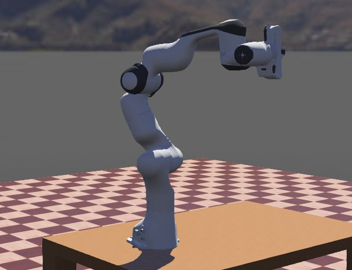
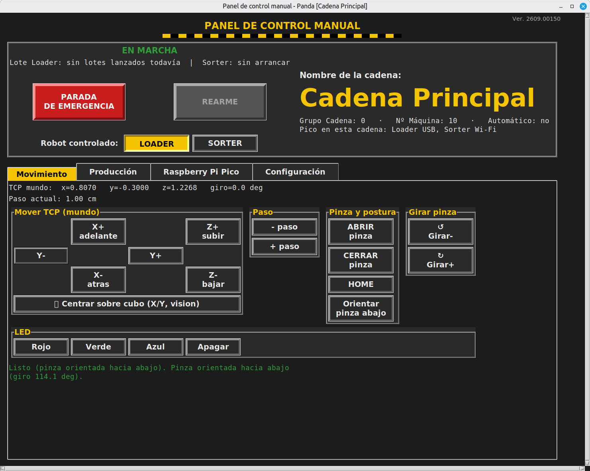

# Our production line

If this is the first time you're seeing this project: this is the part
that moves real robotic arms (well, simulated ones) to make and sort
pieces. You don't need to know anything about robotics to follow this
page — everything is explained from scratch.

## What Webots is

**Webots** is a program that simulates robots in 3D: real physics
(weight, friction, collisions), virtual cameras that "see" the same
thing a real one would, and motors that move exactly like the ones on
the real robot. It's open source, made by the company Cyberbotics, and
it's widely used in research and industry to test a robot **before**
touching it physically — a mistake in the simulation doesn't break
anything or hurt anyone.

In this project, everything you see — the arms, the conveyor belt, the
coloured cubes, the cameras — lives inside Webots. There's no physical
robotic arm moving in a warehouse somewhere; it's a complete virtual
workshop.

## Where the Panda robot comes from

The **Panda** is a real robotic arm, made by the German company
**Franka Emika**. It's what's called a "cobot" (collaborative robot):
it's designed to work near people without safety cages, because it
controls the force it applies in every movement and can be programmed
to be precise and gentle. It's one of the most widely used arms in
robotics universities and research centres around the world.

Webots ships with an official 3D model of this robot, with its real
geometry and physics (7 joints, real movement limits, the same
two-finger gripper). That's why what gets tested here in the simulation
behaves the same way the real arm would.

## Our two Pandas

This project doesn't use one Panda arm, but **two**, each with its own
job within a small industrial cell:

- **Loader** ("the one that loads"): picks pieces (coloured cubes) up
  from a box and places them on a conveyor belt.
- **Sorter** ("the one that sorts"): waits at the end of the belt, sees
  what colour piece is arriving with a camera, picks it up and puts it
  in the box that matches that colour.

Between the two of them, each piece travels the whole route on its
own: it gets loaded, carried and sorted, without anyone having to touch
anything by hand.

To keep things simple (there's no infinite factory of cubes behind the
scenes), as soon as a piece finishes being sorted it **goes back to its
own box on its own**, ready for the Loader to pick it up again — that's
how a continuous production system is simulated, one that never runs
out of pieces, with just a handful of real cubes going round and round
the whole time.

## The "nodes": what they are and which ones we have

All of this is controlled with **ROS 2** (Robot Operating System),
which is the standard "operating system" for programming robots. The
central idea in ROS 2 is **nodes**: small, independent programs, each
with a specific job, that talk to each other by sending messages over
"channels" (called *topics*) — a bit like a group of walkie-talkies
where each device only says its own bit and listens for what matters
to it.

These are the main nodes in this cell, explained in one line each:

- **The Webots driver** (one per robot): receives "move the arm to this
  position" orders and makes the simulated robot actually move inside
  Webots. It's **the only piece that knows the robot is fake**: every
  other node just says "put the joints like this" and "close the
  gripper this much", without knowing who's obeying. That's why, the
  day we have a real Panda, this driver would talk to **the real robot
  instead of the simulator** and the other nodes would stay exactly the
  same. (It would need to be swapped for the real Panda's own driver,
  and speed, safety and the cameras — which are also simulated right
  now — would need careful testing.)
- **`loader_demo` / `sorter_demo`**: the "brain" of each robot — they
  decide what to do step by step (go to a piece, grab it, carry it,
  release it) and send that to the driver.
- **The overhead cameras**: look at the table from above and say
  "there's a green cube at this position" — that's how the robot knows
  where to go without anyone telling it the coordinates by hand.
- **The warehouse supervisor**: watches that pieces don't get lost or
  end up stuck in an impossible position, and repositions them if
  needed.
- **The LED bridges**: if a physical Raspberry Pi Pico is connected,
  they light up a real LED in the colour currently being made. Without
  a Pico, the cell works exactly the same, there's just no physical
  light — if you want to see the simulation anyway, it's in our control
  panel, on the **Raspberry Pi Pico** tab.
- **The control panel** (`teleop_gui`): the window from which a person
  moves the robots by hand, launches production, and sees the state of
  everything at a glance. If one day there's more than one cell running
  at once (more than one "production line"), **each one has its own
  independent panel** — each window only controls the robots on its own
  line, even though they all share the same web orders panel.

<a href="/manual/lanzar/assets/Documentacion/panel_control_manual.html" style="display:block; margin:0 0 1.3rem; padding:1rem 1.2rem; background:var(--bg-elevated); border:1px solid var(--line); border-left:4px solid var(--accent-brick); border-radius:6px; text-decoration:none; color:inherit;">
  <strong style="color:var(--accent-brick);">📋 The manual control panel, tab by tab</strong> 
  What each button and each tab does, with a screenshot of every one.
</a>

## More than one production line

Since each line is an independent set of containers with its own panel
(see above), you can switch on a second one, a third one... on the same
machine, all working at once and sharing the same web orders panel,
without stepping on each other. There's already a ready-made, tested
template for doing this — a step-by-step guide, meant to be followed
without being a programmer, at
[How to add another production line](/manual/lanzar/assets/Documentacion/anadir_cadena_produccion.html).

## How to see it working

The steps to start the simulation (Webots + the robots + the control
panel) are in [How to start everything](/manual/lanzar) — it's the
guide meant to be followed literally, copying and pasting commands.

## If you want the technical detail

This page stays at the "what it is and what it's for" level. All the
internal architecture (how the movements are calculated, what design
decisions were made and why, the full history of how it was built) is
kept separately, in
[`detalle_tecnico_panda.md`](detalle_tecnico_panda.md) — meant for
anyone who wants to get into programming or modifying something, you
don't need to read it to use the cell.
