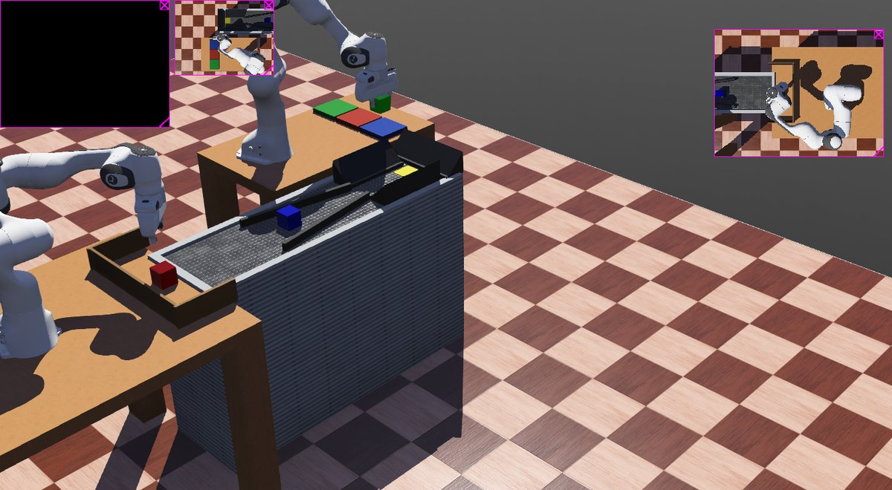
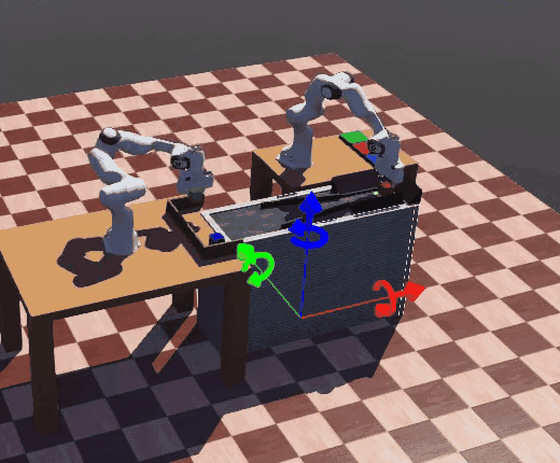
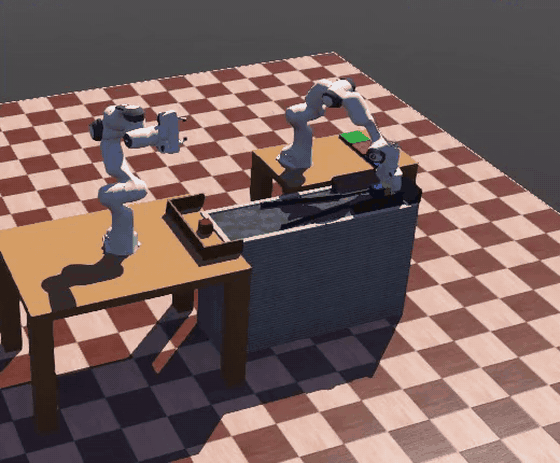
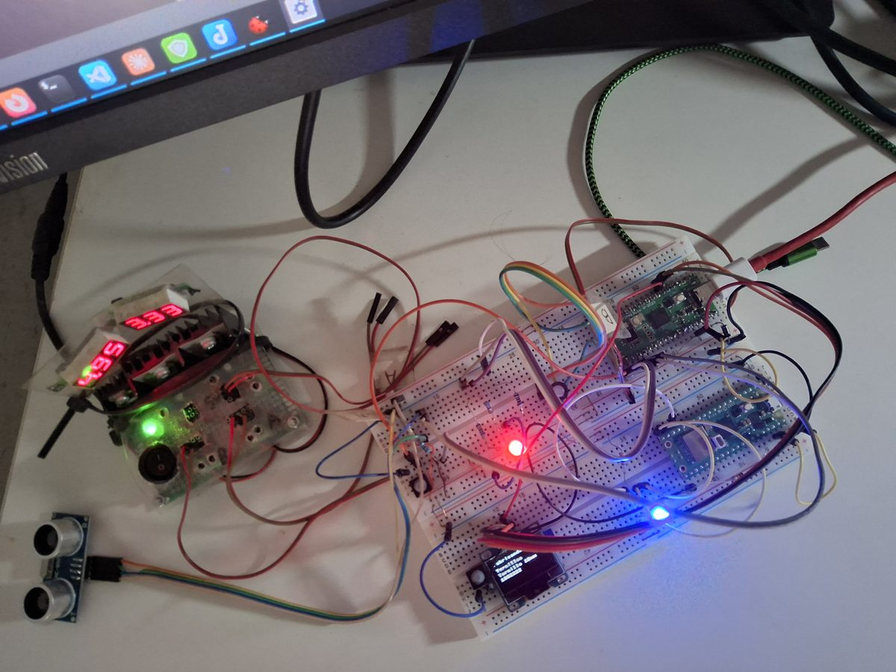

**Idioma:** [English](README.md) · Español · [Euskara](README.eu.md)

# Virtual Robotic

Un proyecto personal de aficionado, no una empresa de verdad. Empezó por
curiosidad —querer entender cómo se mueve un brazo robótico de verdad— y
acabó siendo una celda industrial completa: dos brazos que cogen y
clasifican cubos de colores por una cinta, y una web que lleva los pedidos
como si fuera un taller real.



**Vídeos de la celda trabajando** (30 segundos cada uno; se mueven solos; si pulsas uno, te bajas el vídeo en buena calidad):

[](Virtual_Robotic/img/celda_trabajando_1.mp4)
[](Virtual_Robotic/img/celda_trabajando_2.mp4)

## Qué hay aquí

**1. La celda de robots, simulada.** Dos brazos robóticos (el modelo
Franka Emika Panda) trabajan dentro de **Webots**, un programa que imita la
física de verdad. Uno pone cubos en una cinta y el otro los recoge y los
clasifica por color, comprobando con cámaras que de verdad ha cogido lo que
cree. Por debajo, las piezas se hablan con **ROS 2**, el «sistema nervioso»
que usan casi todos los robots reales.

**2. La web de pedidos.** Una web normal que hace de oficina del taller:
los clientes piden, los robots fabrican, el almacén se lleva solo y salen
albaranes y facturas. Es lo más fácil de probar: no necesita la simulación.

**3. Dos Raspberry Pi Pico, opcionales.** Placas diminutas (unos 5 €) con
LED, un sensor de proximidad, una pantallita y botones de parada de
emergencia de verdad. Son el puente entre lo virtual y lo físico, pero
**sin ellas todo funciona igual**: el panel de control las dibuja en
pantalla.



Construido junto con **[Claude Code](https://claude.com/claude-code)**
(Anthropic): el diseño y buena parte del código salieron de sesiones de
trabajo con Claude.

## Probarlo en 3 pasos (solo la web)

Con [Docker](https://www.docker.com/) y Git instalados:

```bash
git clone https://github.com/virtual-robotic/virtual-robotic.git
cd virtual-robotic/Taller_Administracion
docker compose up -d --build
```

Abre **http://localhost:8000**. Ahí está la web de presentación, que hace
de manual del proyecto, y el botón para entrar. Ya trae productos y
clientes de ejemplo para jugar.

### Quién hace qué en la web

| Entras como… | Contraseña | Eres… | Puedes… |
|---|---|---|---|
| `admin` | `admin` | El taller | Verlo todo, mandar fabricar, repartir, sacar albaranes y facturas. **No hace pedidos.** |
| `ere-admin` | `1111` | Un cliente de ejemplo (Ereño) | **Hacer pedidos** y ver sus pedidos, albaranes y facturas. |

Para probar un pedido de principio a fin: entra como `ere-admin`, haz el
pedido, y luego entra como `admin` para ver cómo se reparte y se factura.

## ¿Dónde está cada cosa?

| Quiero… | Dónde |
|---|---|
| Instalarlo y arrancarlo todo en **Linux** (con robots) | [LANZAR_PROYECTO.md](LANZAR_PROYECTO.md) — o `./arrancar_todo.sh` |
| Instalarlo y arrancarlo en **Windows** (con robots) | [INSTALAR_WINDOWS.md](INSTALAR_WINDOWS.md) — o doble clic en `arrancar_windows.bat` |
| Tener **varias líneas** de robots a la vez | [Documentacion/anadir_cadena_produccion.md](Documentacion/anadir_cadena_produccion.md) |
| Usar la web: pedidos, almacén, reparto, facturas | [Taller_Administracion/README.md](Taller_Administracion/README.md) |
| Montar las Raspberry Pi Pico | [Documentacion/PI_PICO_montaje.html](Documentacion/PI_PICO_montaje.html) |
| Arreglar algo que falla | [PROBLEMAS_CONOCIDOS.md](PROBLEMAS_CONOCIDOS.md) |
| Construirlo desde cero con Claude Code (experimental, probado en Linux) | [Promt Genera Proyecto Virtual Robotic.md](Documentacion/Promt%20Genera%20Proyecto%20Virtual%20Robotic.md) |
| Saber cómo está hecho por dentro | [Lab.Panda 2.4/detalle_tecnico_panda.md](Lab.Panda%202.4/detalle_tecnico_panda.md) |

### Dónde funciona hoy

| | Web de pedidos | Celda con robots |
|---|---|---|
| **Linux** | Sí | Sí |
| **Windows** (PC de verdad) | Sí | Sí, con Webots instalado en Windows |
| **Windows dentro de VirtualBox** | No | No (VirtualBox no lo permite) |
| **Mac** | Sin probar | Sin probar |

Para **ver** la web desde un Mac o un iPhone (navegador Safari) no hace falta
instalar nada; eso tampoco está comprobado todavía, pero no esperamos problemas.

## Qué hay en cada carpeta

- `Lab.Panda 2.4/` — la simulación: Webots y el programa de los robots.
- `Taller_Administracion/` — la web de pedidos y su web de presentación.
- `Virtual_Robotic/` — la misma web de presentación, para abrir con doble
  clic sin Docker.
- `Rasberry_Pi_Pico/` y `Rasberry_Pi_Pico_USB_Loader/` — el programa de las
  dos Pico. `wifi_config.py` y `webrepl_cfg.py` son solo plantillas: pon ahí
  tus claves y **no las subas nunca** (ver
  [LANZAR_PROYECTO.md](LANZAR_PROYECTO.md), «Tu Wi-Fi: las claves de la Pico W»).
- `Documentacion/` — guías de montaje y notas técnicas; no hace falta
  leerla para arrancar.
- Los ficheros sueltos de la carpeta principal (`arrancar_todo.sh`,
  `arrancar_windows.bat`, `crear_linea.sh`…) son los atajos para arrancar y
  apagar; cada guía explica cuál usar.

## Licencia

**MIT** (ver [LICENSE](LICENSE)). En palabras sencillas: puedes usar,
copiar, cambiar y compartir este proyecto como quieras, incluso para algo
comercial, siempre que mantengas el aviso de la licencia con el nombre del
autor. Se entrega tal cual, sin garantía.

Las piezas de otros que usa el proyecto (Webots, los modelos del robot
Panda, ROS 2, FastAPI…) no son nuestras y siguen con sus propias licencias.
