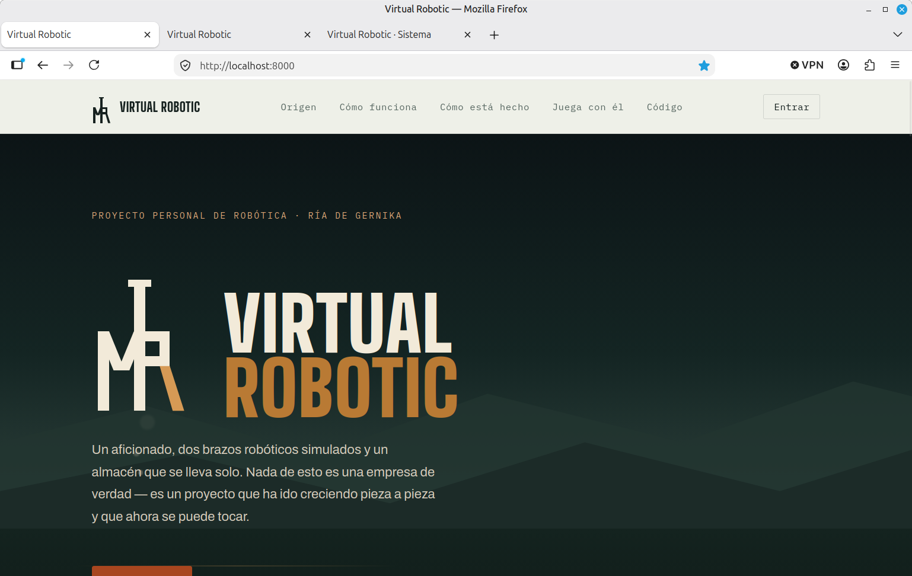

# Virtual Robotic

Un proyecto personal de aficionado, no una empresa de verdad. Esto
empezó por curiosidad — querer entender cómo se mueve un brazo
robótico de verdad — y acabó siendo una celda industrial completa:
dos brazos que cogen y clasifican cubos de colores por una cinta, y
una web que lleva los pedidos como si fuera un taller real.


## ¿Qué es exactamente lo que hay aquí?

Tres piezas, y cada una se puede mirar por separado:

**1. La celda robótica — pero simulada, no física.**
Dos brazos robóticos (un modelo real, el Franka Emika Panda) se
mueven dentro de un simulador llamado **Webots**: un programa que
recrea la física de verdad (gravedad, choques, rozamiento) sin
necesidad de tener el robot delante. Un brazo pone cubos en una
cinta, el otro los recoge y los clasifica por color, comprobando con
"visión artificial" (cámaras simuladas + código que interpreta la
imagen) que de verdad ha cogido lo que cree que ha cogido. Por debajo,
todo esto habla entre sí usando **ROS 2**, que es básicamente el
"sistema nervioso" estándar que usa casi cualquier robot de verdad
para que sus piezas de software se comuniquen.

**2. El panel de pedidos — una web normal y corriente.**
Un sitio web (hecho con FastAPI, un framework de Python, y una base
de datos SQLite) que funciona como el back-office de un taller
pequeño: alguien pide productos, el sistema los va fabricando, y el
almacén se lleva solo. Es la parte más fácil de probar porque no
necesita nada del simulador — es una web como cualquier otra.

**3. Dos Raspberry Pi Pico — hardware real y opcional.**
Una Raspberry Pi Pico es un microcontrolador diminuto (unos 5€,
típico en proyectos de electrónica de aficionado). Aquí hay dos:
una enciende un LED real con el color del producto que se está
fabricando, y la otra hace de botón de parada de emergencia con un
sensor de proximidad. Son un capricho físico, no una pieza necesaria:
**si no las tienes, todo lo demás funciona exactamente igual.**

¿Y entonces para qué están? Porque por aquí empezó todo: no tenía un robot de
verdad (un brazo como el Panda cuesta un pastón) pero quería tocar algo físico,
que lo que pasa en el ordenador hiciera algo de verdad fuera de la pantalla. Así
que arranqué con una Pico, un LED y un botón cableados a mano en una protoboard.
Luego creció todo lo demás y las Pico se quedaron como el puente entre lo virtual
y lo físico: el día que llegue un robot de verdad, ya sé cómo enchufarle cosas al ordenador.


Construido junto con **[Claude Code](https://claude.com/claude-code)**
(Anthropic): el diseño, la arquitectura y buena parte del código de
este repositorio salieron de sesiones de trabajo con Claude.

## Probarlo (la parte fácil, sin robots)

Solo necesitas [Docker](https://www.docker.com/) instalado — es un
programa que empaqueta todo el software necesario para que no tengas
que instalar nada más a mano. Con eso, dentro de `Taller_Administracion/`:

```bash
docker compose up -d --build
```

Abre **http://localhost:8000** en el navegador: ahí está la web de
presentación, que hace de **manual del proyecto** (o algo muy parecido),
explicado para que lo entienda cualquiera, sin saber de robots ni de
programación: qué es, cómo funciona cada pieza y cómo se instala. Y
entrando (usuario `admin`, contraseña `admin`) pasas al sistema real de
pedidos y almacén. La primera vez que arranca contra una base de datos
vacía ya trae catálogo y empresas de ejemplo con las que jugar sin dar de
alta nada a mano. Prueba a crear un producto o un pedido y verás cómo se
mueve — todo esto funciona sin tocar el resto del proyecto.



### Requisitos para instalarlo

| | Solo la web de pedidos | La celda con los robots (Webots + ROS 2) |
|---|---|---|
| **Linux** (Linux Mint / Ubuntu 24.04, donde lo hemos probado) | Docker con Docker Compose v2 y Git | Lo anterior + escritorio gráfico con X11 y `xhost`, unos 15 GB de disco, 8 GB de RAM o más e internet la primera vez. Con tarjeta gráfica va fluido; sin ella hay que comentar una línea (`/dev/dri`) del `docker-compose.yml` y va más lento |
| **Windows** | Docker Desktop (con WSL 2) y Git for Windows. **No probado en Windows** | **No probado.** El camino que sí hemos probado es una máquina virtual Linux (VirtualBox con Linux Mint); otra opción, sin probar, es WSL 2 con Ubuntu |

Todo lo demás (Python, FastAPI, ROS 2, Webots…) va dentro de los contenedores. Las Raspberry Pi Pico son opcionales.

### Cómo se instala

**Linux (Linux Mint / Ubuntu 24.04)**

```bash
sudo apt update
sudo apt install -y git docker.io docker-compose-v2
sudo apt install -y x11-xserver-utils      # solo para la celda con robots
sudo usermod -aG docker $USER              # y cierra sesión y vuelve a entrar
docker --version && docker compose version # comprobar que funciona

git clone https://github.com/virtual-robotic/virtual-robotic.git
cd virtual-robotic/Taller_Administracion
docker compose up -d --build               # abre http://localhost:8000 (admin / admin)
```

Para la celda con los robots sigue [LANZAR_PROYECTO.md](LANZAR_PROYECTO.md): la primera vez tarda bastante porque se descarga Webots.

**Windows (solo la web de pedidos)**

1. Instala **Docker Desktop para Windows** desde docker.com, con la opción *Use WSL 2* marcada. Reinicia, abre Docker Desktop y espera a que ponga *Engine running*. Si dice que falta WSL, abre PowerShell **como administrador**, escribe `wsl --install` y reinicia.
2. Instala **Git for Windows** desde git-scm.com.
3. En PowerShell:

   ```powershell
   git clone https://github.com/virtual-robotic/virtual-robotic.git
   cd virtual-robotic\Taller_Administracion
   docker compose up -d --build
   ```

   y abre `http://localhost:8000` (usuario `admin`, contraseña `admin`).

Para los robots en un PC con Windows: instala **VirtualBox**, crea una máquina virtual con **Linux Mint** (4 procesadores, 8 GB de RAM y 40 GB de disco van bien) y sigue dentro los pasos de Linux. En una máquina virtual normalmente no hay aceleración 3D: comenta la línea `/dev/dri` como explica [LANZAR_PROYECTO.md](LANZAR_PROYECTO.md).

Esa web es el manual, de menos a más técnico: «Origen» y «Cómo funciona»
lo cuentan sin tecnicismos, «Cómo está hecho» baja al detalle y ahí tienes
enlazados los tres manuales (cómo arrancar todo, nuestra web de pedidos y
nuestra cadena de producción), con el mismo diseño de la web en vez de
como texto plano. Al final, «Código» explica qué necesitas y cómo se
instala en Linux y en Windows.

## Probarlo del todo (con la simulación)

Levantar también Webots + ROS 2 (dos contenedores más, algo más de
peso) y ver los brazos moviéndose de verdad requiere Docker con
soporte de vídeo (sesión gráfica local, no vale por SSH puro).

**La primera vez, mejor sigue los pasos a mano en
[LANZAR_PROYECTO.md](LANZAR_PROYECTO.md) en vez del atajo de abajo.** No
es que esté roto — es que la primera construcción de la imagen de Webots
descarga un paquete grande y **puede parecer colgada mucho rato
alrededor del 70-80%**; yendo paso a paso ves justo dónde tarda cada
cosa, en vez de pensar que algo ha fallado y cortarlo a media
construcción.


Esto es justo lo que vas a ver: una ventana de Webots con "Downloading
assets" parada en algún punto entre el 70 y el 90% durante un buen rato.
**No le des a Cancel** — solo está bajando el paquete grande de Webots
desde el repositorio de Cyberbotics, y según la red puede tardar varios
minutos. Es un paso que Docker cachea: la próxima vez que construyas esa
misma imagen (en esa máquina) se lo salta entero. Una vez que sabes que
en tu máquina/VM funciona, ya sí:

```bash
./arrancar_todo.sh
```

Levanta los dos proyectos, compila lo que haga falta, lanza la celda
completa y termina abriendo el panel de control manual — sin necesidad
de las Raspberry Pi Pico físicas. Si Webots se queda colgado cargando el
mundo (le pasa a veces en un arranque en frío), el propio script prueba
solo el arreglo conocido (reiniciarlo) antes de rendirse.

**Si aun así `arrancar_todo.sh` no funciona a la primera** (el panel de
control no llega a abrirse, o los controladores no conectan pese al
reintento automático), lo más simple y que mejor funciona en la
práctica es `./cerrar_todo.sh` seguido otra vez de `./arrancar_todo.sh`
— visto en vivo que la segunda vuelta arranca bien aunque la primera
no. No tenemos localizada la causa exacta de por qué falla a veces la
primera vez tras un arranque en frío, así que de momento esta es la
receta que funciona, no una explicación completa. Si prefieres ir paso
a paso, o algo falla igualmente (típico en una VM sin aceleración 3D:
revisa el aviso sobre `/dev/dri`), la guía completa está en
**[LANZAR_PROYECTO.md](LANZAR_PROYECTO.md)**.

Para parar todo al terminar: `./cerrar_todo.sh`.

## Más de una línea de producción a la vez

El taller se puede duplicar: levantar una **segunda celda completa**
(su propio Webots, sus propios robots, su propio panel de control)
trabajando en paralelo con la primera, en el mismo ordenador, sin que
se estorben. Las dos comparten el mismo código y el mismo panel de
pedidos.

Lo interesante es cómo se reparten el trabajo sin pisarse: cada línea
tiene un **"Nº Máquina"** que se configura en su panel, y en cuanto una
línea coge un pedido lo marca con su número — a partir de ahí las demás
dejan de verlo como disponible. Así nunca se fabrica dos veces lo
mismo, y de regalo queda registrado qué máquina hizo cada pedido.

La plantilla ya hecha está en `Lab.Panda 2.4/.devcontainer2/`, y los
pasos para usarla (o para montar una tercera, cuarta...) están en
**[Documentacion/anadir_cadena_produccion.md](Documentacion/anadir_cadena_produccion.md)**.
No hace falta para nada si solo quieres probar el proyecto: con una
línea funciona todo igual.

## Qué hay en cada carpeta

- `Lab.Panda 2.4/` — la simulación: Webots, el código ROS 2 de los
  brazos, la cámara/visión artificial y el control del agarre.
- `Taller_Administracion/` — el panel web (pedidos, almacén, usuarios)
  y la propia web de presentación que ves al abrir el puerto 8000.
- `Virtual_Robotic/` — esa misma web de presentación, pero en una
  copia suelta que ni siquiera necesita Docker: la abres con doble
  clic en `index.html` y ya está.
- `Rasberry_Pi_Pico/` y `Rasberry_Pi_Pico_USB_Loader/` — el código de
  las dos Pico. Si vas a usar hardware real, `wifi_config.py` y
  `webrepl_cfg.py` son solo una plantilla: pon ahí tus propias claves y
  **no las subas nunca** (cómo evitarlo, en [LANZAR_PROYECTO.md](LANZAR_PROYECTO.md),
  apartado «Tu Wi-Fi: las claves de la Pico W»).
- `Documentacion/` — notas técnicas, esquemas de cableado y análisis
  más a fondo de piezas concretas (carriles de la cinta, LED, botón de
  parada...); no hace falta leerla para arrancar el proyecto.
- `arrancar_todo.sh` y `cerrar_todo.sh` — los atajos de arriba, por si
  prefieres leer antes de ejecutar: no hacen nada que no esté también
  descrito a mano en `LANZAR_PROYECTO.md`.
- `generar_version.sh` — calcula el "Ver. AAMM.NNNNN" que se ve en el
  panel y en el panel de control manual, a partir del propio `git`; lo
  llama `arrancar_todo.sh` solo, no hace falta acordarse de él a mano.
- `backup_nas.sh` — copia de seguridad (bundle de `git` + base de
  datos) con una tercera copia automática al NAS si está encendido.

Sin licencia explícita todavía — es un proyecto personal en marcha,
no pensado (de momento) para reutilización de terceros.
