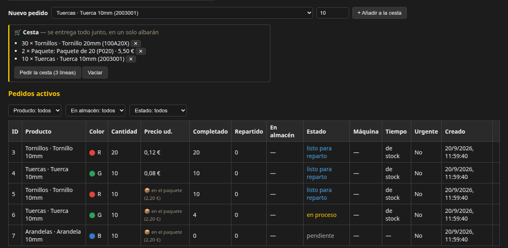
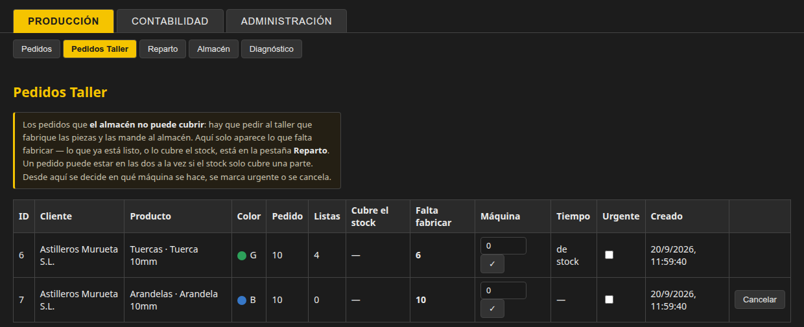
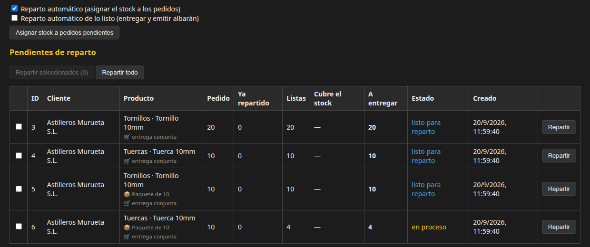
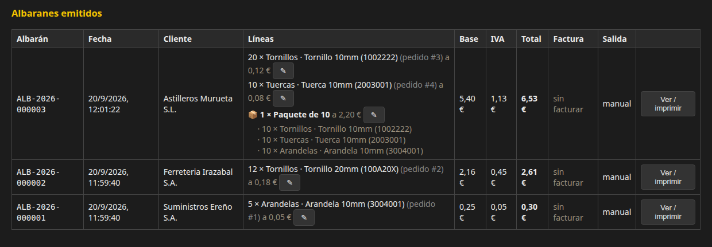
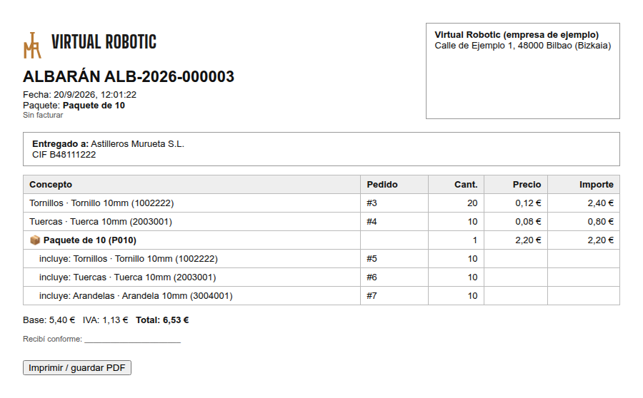
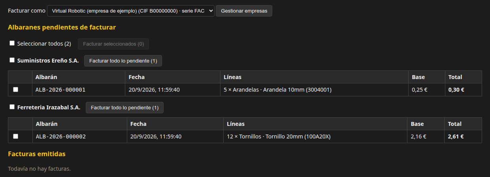
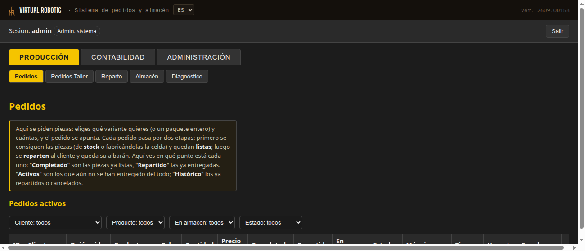

# Gure eskaera webgunea

Lehen aldiz ikusten baduzu: hau da **tailerraren bulegoa**. Hemen eskatzen
dira piezak, zer fabrikatzen den apuntatzen da, soberakina biltegian gordetzen
da, bezeroari bere albaranarekin entregatzen zaio eta fakturatzen da.
Gelaxkako robotak (Loader eta Sorter) dira benetako **tailerra**; web honek
esaten die zer behar den eta apuntatzen du zer egiten ari diren. Ez duzu
informatikaz ezer jakin behar orrialde hau jarraitzeko: adibidezko eskaera
batekin kontatzen da, urratsez urrats.

> Web hau itzalita badago, gelaxkak berdin-berdin funtzionatzen jarraitzen du.
> Gertatzen den bakarra da inork ez duela ekoizpena apuntatzen eskaera
> batean.

## Eskaera baten bidaia, hasieratik amaierara

**🛒 Eskatzen da** → **🏭 Lortzen da** (biltegitik edo fabrikatuta) → **✅ Prest gelditzen da** → **🚚 Banatzen da** (albarana) → **🧾 Fakturatzen da**

Adibide bat: *Astilleros Murueta* enpresak 20 torloju, 10 azkoin eta pieza
askotariko pakete bat behar ditu, eta Bilboko sukurtsalak eskatzen ditu.

### 1. Saskiarekin eskatzen da 🛒

**Nork eskatzen duen.** **Bezero baten erabiltzaile** batek eskatzen du.
Bezero bakoitzak (adibidez, Astilleros Murueta) admin erabiltzaile bat du eta,
nahi izanez gero, bat **sukurtsal** bakoitzeko (Bilbo, Bartzelona,
Madril...). Piezak behar dituenak webgunea irekitzen du bere nabigatzailean
(beste fitxa batean edo beste ordenagailu batean, berdin dio), **Sartu**
sakatzen du eta bere erabiltzailea eta pasahitza sartzen ditu; adibidean,
Astilleros Muruetaren `mur-bilbao` erabiltzailea. Sartzean **Eskaerak** fitxa
bakarrik ikusten du, eta zerrendan bere enpresak eska ditzakeen piezak
bakarrik ateratzen zaizkio. Eskaera bakoitzean apuntatuta geratzen da **zein
bezerok eskatu duen eta zein erabiltzailek egin duen**; enpresaren
administratzaileak bere sukurtsal guztietakoak ikusten ditu, eta albarana eta
faktura **bezeroaren** izenean ateratzen dira, ez sukurtsalarenean.

Denda bat bezala da: produktu bat **edo pakete oso bat** aukeratzen duzu,
zenbat esaten duzu, eta saskira sartzen duzu. Saskia nahi duzun bezala
dagoenean, **Saskia eskatu** sakatzen duzu. Saski bateko guztia batera
bidaltzen da eta **albaran bakar batean** aterako da. Gauza bakar bateko
eskaera lerro bakarreko saski bat besterik ez da.



Saskiaren azpian eskaera bakoitzak egoera aldatzen doa: *zain* (oraindik hasi
gabe), *prozesuan* (piezak lortzen ari dira), *banatzeko prest* (jada
guztiak daude, ateratzeko zain) eta *banatuta* (jada entregatu dira).

### 2. Lortzen da: biltegitik edo fabrikatuta 🏭

Sistemak lehenengo egiten duena **biltegia** begiratzea da. Jada piezak
gordeta badaude, unean bertan esleitzen zaizkio eskaerari eta ez da ezer
fabrikatu behar. Ez badago, falta dena **Tailerreko Eskaerak**en apuntatzen
da, robotentzako erosketa zerrenda dena: gelaxkak pieza horiek fabrikatzen
jarraitzen du eta, amaitu ahala, webgunea abisatzen du eta eskaerak bere
kabuz aurrera egiten du.



Hemen erabaki daiteke zein makinatan egiten den eskaera bakoitza, **urgente**
gisa markatu edo bertan behera utzi.


Pieza horiek fabrikatzen dituen gure ekoizpen katea
[Gure ekoizpen katea](/manual/panda)n azaltzen da.

### 3. Prest gelditzen da eta banatzen da 🚚

Eskaerako pieza **guztiak** jada daudenean (saski batekoak badira, saskiko
guztiak), bigarren fasea iristen da: **Banaketa**. Bezeroari entregatzen
zaio eta **albaran** batekin apuntatzen da, entregatutakoaren egiaztagiria
dena. Bi etengailu ditu: bata stocka eskaerei bakarrik esleitzeko, eta
bestea jada prest dagoena bakarrik entregatzeko. Azken hori itzalita,
guztia hemen itxaroten du norbaitek **Banatu** sakatu arte.



**Pakete** bat beti osorik entregatzen da: pieza bakar bat falta bada,
paketea itxaroten du. Eta saski batek osatu arte itxaroten du, bezeroak
**albaran bakar bat** jaso dezan hiruren ordez.

### 4. Albarana 📄

Entrega lagundu duen orria da. Pakete bat **pakete bat** gisa ateratzen da
(bere prezioarekin) eta azpian, txiki, barruan daramana.



Ikusi eta inprimatu (edo PDF gisa gorde) daiteke enpresaren logotipoarekin,
entregatzen duenaren eta jasotzen duenaren datuekin, eta BEZarekin
zenbatekoarekin.



### 5. Fakturatzen da 🧾

Hilaren amaieran (edo tokatzen denean), oraindik kobratu ez diren bezero
baten albaranak **faktura** batean biltzen dira. Guztia markatu daiteke,
bezero baten guztiak markatu, edo albaranez albaran aukeratu. Akatsen bat
badago, faktura ez da editatzen: beste **zuzenketa** batekin baliogabetzen
da eta albaranak berriro fakturatzeko libre geratzen dira, jada zuzenduta.
Hainbat enpresatatik fakturatu daiteke, bakoitza bere zenbaketarekin.



## Nork zer egin dezakeen

| Nork sartzen den | Zer ikusten duen |
|---|---|
| **Erabiltzaile arrunta** (bezeroaren langile bat) | **Eskaerak** fitxa bakarrik: saskiarekin eskatzen du eta bereak nola doazen ikusten du |
| **Bezero enpresa baten administratzailea** | Aurrekoa bere enpresa osoarena, gehi bere albaranak eta fakturak |
| **Sistemaren administratzailea** (tailerra) | Dena: ekoizpena, kontabilitatea eta oinarrizko datuak (produktuak, bezeroak, prezioak...) |

## Jakin behar diren gauzak

- **Prezioak izoztu egiten dira eskatzean.** Bihar tarifa aldatzen bada,
  jada egindako eskaerek eskatu zireneko prezioa mantentzen dute. Bezero
  bakoitzak bere prezio propioak izan ditzake.
- **Ezer ez da isilean ezabatzen.** Prezio edo egoera aldaketa oro
  apuntatuta geratzen da: nork, noiz eta zenbatetik zenbatera.
- **Stocka ez da isilean banatzen.** *Banaketa automatiko* etengailu bat
  dago: piztuta, gordetako piezak bakarrik esleitzen zaizkie behar dituzten
  eskaerei; itzalita, geldi geratzen dira norbaitek **Stocka esleitu**
  sakatu arte.
- **Beldurrik gabe jolas dezakezu**: ikasteko proiektu bat da. Demoaren
  datuak asmatuak dira eta adibidezko erabiltzaileen pasahitza `1111` da.

---

## Xehetasun teknikoa nahi duenarentzat

Gelaxka industrialaren eskaera eta biltegi datu-basea + web zerbitzaria.
Gelaxkatik **bereizitako** proiektua da: HTTP bidez bakarrik hitz egiten
dute. Itzalita badago, gelaxkak funtzionatzen jarraitzen du, inork ez du
ekoizpena apuntatzen besterik ez.

Stacka: FastAPI 0.115.0 + SQLAlchemy 2.0.35 + pydantic 2.9.2 + SQLite,
uvicornek zerbitzatua `--reload`rekin. API interaktiboa `/docs`en.

## Zerbitzatutako bideak

- `/` — `app/static/landing.html`: "Virtual Robotic" aurkezpen web-orria
  (`../Virtual_Robotic/index.html`ren marka/tipografia bera, baina hemen
  login-a benetakoa da app hau bera jada martxan dagoelako).
  Portada **gaztelaniaz, ingelesez eta euskaraz** irakur daiteke (goiko
  ES/EN/EU hautagailua): itzulitako testuak `app/static/i18n_landing.js`n
  daude (eta `../Virtual_Robotic/`ko kopian). Eskaera sistema (`/panel`)
  eta bere eskuliburuak gaztelaniaz bakarrik jarraitzen dute; robotak
  kontrolatzeko panela (`teleop_gui`) jada hiru hizkuntzetan dago.
- `/panel` — `app/static/panel.html`: benetako sistema (eskaerak, biltegia,
  erabiltzaileak). `/`rekin saioa partekatzen du `sessionStorage`
  bidez (`taller_token`, `taller_yo`): behin sartu landing-etik eta ez du
  berriro login eskatzen.
- `/manual/{lanzar,taller,panda}` — `LANZAR_PROYECTO.md`, proiektu honen
  README-a eta `Lab.Panda 2.4`ren laburpena zuzenean zerbitzatzen ditu,
  landing-etik lotuta. `docker-compose.yml`ko `..:/workspace/repo:ro`
  bolumena behar du (proiektu gurasoa irakurtzeko soilik muntatua) —
  Dockerretik kanpo benetako diskoko bidera erortzen da bakarrik
  (`TALLER_REPO_DIR`, lehenespenez `app/`tik bi maila gora).

## Abiaraztea

```bash
docker compose up -d --build
```

Ostalariaren **8000** portua argitaratzen du. `data/taller.db` bakarrik
sortzen da abiaraztean (`./data` bolumenaren barruan, git-ek ez ikusia).
Datu-base hutsaren aurka lehen aldiz abiaraztean, zerbitzariak berak
adibidezko datuak ereiten ditu (ikusi `SEED_*` eta `sembrar_datos()`
`app/main.py`n), ezer eskuz alta eman gabe jolastu ahal izateko:

- 7 LED kolore (R/G/B kubo fisikoarekin, Y/M/C/W LED soilik), 3 produktu
  (Torlojuak/100, Azkoinak/200, Arandelak/300) beren azpiproduktuekin
  (10mm/20mm aldaerak) eta 2 adibidezko pakete (P010, P020).
- **Hasierako bezero eta erabiltzaileak**,
  `Documentacion/UsuariosBBDDArranque.txt`tik irakurriak (ikusi "Hasierako
  bezero eta erabiltzaileak" beherago), guztiak katalogo osoarekin eta
  hasierako `1111` pasahitzarekin. Fitxategi hori ez badago, kodeko 3
  adibidezko enpresa ereiten dira.
- `admin` erabiltzailea (`admin_sistema`, `admin` pasahitza lehenespenez —
  `TALLER_ADMIN_PASSWORD`rekin konfiguragarria).
- Biltegiaren konfigurazioa `reparto_automatico = True` eta
  `expedicion_automatica = True`rekin (banaketaren bi etengailuak, ikusi
  "Eskaera baten zikloa").
- Adibidezko prezioak azpiproduktuetan (zentimotan, BEZ gabe; % 21eko
  BEZa) albaranak lehen abiaraztetik zenbatekoekin ateratzeko, eta
  adibidezko enpresa emaile bat (fakturatu ahal izateko; aldatu
  Administrazioa → Enpresak atalean).

### Hasierako bezero eta erabiltzaileak

Datu-base **huts** bat `Documentacion/UsuariosBBDDArranque.txt`ko (edo
`TALLER_DATOS_ARRANQUE`k esaten duen fitxategiko) bezero eta
erabiltzaileekin betetzen da. Eskuz editatzen den testu bat da:

```
Cliente:
    R.S.: Astilleros Murueta S.L.        <- izen soziala; bezero bat hasten du
    Cod.: MUR                            <- AUKERAKOA: 3 letra/zifrako kodea; gabe, izen sozialetik ateratzen da
    Cif : B48111222
    Dir.: Carretera Bermeo 34
    C.P.: 48333
    Pob.: Murueta
    Pro.: Bizkaia
    cor.: administracion@example.com
    Productos: 100, Arandelas             <- AUKERAKOA (kodea edo izena); gabe, GUZTIAK
        sucursal admin -> Murueta         <- erabiltzailea  mur-admin   (enpresaren administratzailea)
        sucursal -> Bilbao   nombre -> Ana López   <- erabiltzailea  mur-bilbao   (izena AUKERAKOA)
        sucursal -> Madrid                <- erabiltzailea  mur-madrid
```

- **Erabiltzailea bezeroaren kodetik eta sukurtsaletik ateratzen da
  bakarrik**: `<kodea>-admin` enpresaren administratzailearentzat
  (`admin_cliente`) eta `<kodea>-<sukurtsala>` sukurtsal bakoitzarentzat
  (`normal`). Horrela bi bezerok bakoitzak bere Bilboko sukurtsala izan
  dezake (`mur-bilbao`, `ere-bilbao`) izenik asmatu gabe, eta
  erabiltzailetik ikusten da eskaera zein bezerorena den. `nombre ->`
  gabe, izen osoa "Administratzailea <sukurtsala>" edo "Langilea
  <sukurtsala>" da. Forma zaharra, erabiltzailea eskuz idatzita
  (`user normal-> bilbao2 sucursal -> Bilbao`), balio du oraindik.
  Erabiltzaileak minuskulaz gordetzen dira.
- Panelean (**Administrazioa → Bezeroak**) kodea ikusten eta aldatzen da
  (sistemaren administratzaileak bakarrik); erabiltzaile bat altan
  ematean, erabiltzailea hutsik uzten baduzu berdin osatzen da bezeroaren
  kodearekin eta sukurtsalarekin. Datu-base zahar bateko bezeroek kode
  bat jasotzen dute bakarrik, beren erabiltzaileak berrizendatu gabe.
- Guztiak **`1111`** pasahitzarekin jaiotzen dira (beste bat:
  `TALLER_PASSWORD_INICIAL`). Fitxategiak **ez du pasahitzik daramatza**
  eta ez du eraman behar: git partekatura joaten da.
- Errore batek (kode gaizki osatua edo errepikatua, erabiltzaile
  errepikatua, `sucursal admin` gabeko bezeroa, existitzen ez den
  produktu bat…) **abiaraztea gelditzen du**, lerroa esanez, erdizka
  kargatu beharrean. `tests/test_datos_arranque.py` eta
  `tests/test_codigos_cliente.py`k gainera egiaztatzen dute benetako
  fitxategia baliozkoa dela.
- Datu-base **hutsarekin** bakarrik erabiltzen da. Jada datuak dituen
  datu-base bati falta dena gehitzeko, ezer ezabatu gabe (CIF bera duen
  bezero bat edo izen bera duen erabiltzaile bat baztertu eta zerrendatu
  egiten da):

  ```bash
  docker exec taller_admin_api python -m app.cargar_arranque
  ```

  Datu-base zahar bat kodearen araberako erabiltzaileetara **pasatzeko**,
  gehitu `--renombrar`: jada dauden bezeroek (CIF berarekin) fitxategiko
  kodea jasotzen dute eta sukurtsal eta rol bereko erabiltzaileak izen
  berrira pasatzen dira (`murueta` → `mur-admin`, `bilbao` →
  `mur-bilbao`); eskaerak eta albaranak ez dira ukitzen.

`TALLER_DEV_MODE=true`rekin (repositorio honen `docker-compose.yml`n
lehenespenez aktibo) pasahitz nagusiak (`TALLER_MASTER_PASSWORD`,
lehenespenez `1111`) balio du goiko adibidezko erabiltzaile edozein
bezala sartzeko, beren pasahitzik behar izan gabe — hain zuzen
pentsatuta repositorioa makina berri batean klonatzeko eta lehen
abiaraztetik zerbaitekin jolasteko.

## Panela barrutik (fitxaz fitxa)



`/panel`en barruan behin, goian-goian **hiru atal** daude eta, bakoitzaren
barruan, bere fitxak:

| Atala | Fitxak (admin_sistema) | Zer egiten den han |
|---|---|---|
| **Ekoizpena** | Eskaerak · Tailerreko Eskaerak · Banaketa · Biltegia · Diagnostikoa | Eguneroko lana: piezak eskatu, fabrikatu, gorde eta entregatu |
| **Kontabilitatea** | Laburpena · Tarifak · Fakturazioa | Prezioak, fakturak, kobrantzak eta zenbat falta den kobratzeko |
| **Administrazioa** | Enpresa · Produktuak · Azpiproduktuak · Paketeak · Koloreak · Katalogoa · Erabiltzaileak · Bezeroak · Auditoria | Oinarrizko datuak: katalogoa, bezeroak, erabiltzaileak eta nork fakturatzen duen |

`admin_cliente` batek hiru atal berak ikusten ditu baina murriztuta
(Ekoizpena: Eskaerak · Kontabilitatea: Laburpena, Albaranak, Fakturak ·
Administrazioa: Katalogoa, Erabiltzaileak). `normal` erabiltzaile batek
Eskaerak bakarrik du eta ez du atalen menua ikusten. Hau da fitxa
bakoitzak egiten duena, teknizismorik gabe kontatuta:

- **Eskaerak**: eguneroko fitxa. **Beti saskiarekin** eskatzen da: pieza
  bat edo pakete oso bat eta zenbat aukeratzen duzu, **+ Saskira gehitu**,
  eta nahi duzun bezala dagoenean, **Saskia eskatu**. Saski bateko guztia
  batera entregatzen da, albaran bakar batean; gauza bakar bateko eskaera
  lerro bakarreko saski bat da. Saskia nabigatzailean gordetzen da eskatu
  arte. Eskatutakoan, gelaxka bere kabuz fabrikatzen hasten da. Aurrera
  doan heinean zenbat egin dituen ikusten duzu, gordeta zegoen stockek
  eskaeraren zati bat edo guztia ezer fabrikatu gabe estaltzen ote zuen,
  eta zein makinatan egiten ari den (ekoizpen lerro bat baino gehiago
  baduzu). "Aktibo" eskaerak oraindik osatu gabe daudenak dira;
  "historikoa" jada amaitu edo bertan behera utzitakoak.
- **Produktuak**: orokorrean zer fabrikatzen den katalogoa — "Torlojuak",
  "Azkoinak"... Produktu bakoitzak kode labur bat du eta, nahi baduzu,
  kolore LED bat esleitu diezaiokezu: dekorazio hutsa da (brazo robotean
  pizten da fabrikatzen ari den bitartean) eta ez du inolaz ere eragiten
  ekoizpena funtzionatzeari.
- **Azpiproduktuak**: produktu bakoitzaren aldaera zehatzak — "Torlojuak"en
  barruan "10mm-ko torlojua" eta "20mm-koa" izan ditzakezu. Hau da
  benetan eskaera batean eskatzen dena, ez produktua bakarrik.
- **Paketeak**: aldi berean hainbat piezaren pack itxiak, "10eko paketea"
  bezala = 10 torloju + 10 azkoin + 10 arandela. Ez dute beren stockik:
  pakete bat eskatzeak osatzen duen pieza bakoitzeko eskaera arrunt bat
  sortzen du besterik ez.
- **Koloreak**: produktu bati esleitu diezaiokezun LED koloreen
  katalogoa. "Fisiko" gisa markatutakoak simulazioan benetan kubo gisa
  existitzen dira; gainerakoak argi dekoratiboak besterik ez dira.
- **Katalogoa**: hemen erabakitzen duzu bezero bakoitzak zein produktu
  eska ditzakeen — produktu bat bezero baterako markatuta ez badago,
  bezero horrek ez du ikusiko ere bere eskaera zerrendan. Nahitaez egin
  behar den urratsa da: bezero berri bakoitzari eskuz esleitu behar zaio
  bere katalogoa (ezer ez dago markatuta lehenespenez), bestela,
  erabiltzaileak izanda ere, ezingo du ezer eskatu.
- **Erabiltzaileak**: nork sar dezakeen eta zer uki dezakeen. Agindu
  katea, begirada batean:

  ```
  Sistemaren admin.  (zu)
    └─ dena ikusi eta ukitzen du, bezero guztiena

  Bezeroa (enpresa) ── bere "Bezeroaren admin." kontuarekin sartzen da
    └─ BERE Erabiltzaileak alta ematen / editatzen / baja ematen ditu (rol "Arrunta")
         └─ "Arrunta" Erabiltzaile bakoitza berearekin sartzen da eta BERE eskaerak egiten ditu
  ```

  Hau da: bezeroa bere administratzaile kontuarekin sartzen da, bere
  jendea kudeatzen du (erabiltzaileak, sukurtsalak) administrazioari ezer
  eskatu gabe, eta erabiltzaile horietako bakoitza jada bere kontuarekin
  sartzen da behar duena eskatzeko. "Bezeroaren admin." batek ezin ditu
  beste enpresa baten erabiltzaileak ikusi ez ukitu, ezta "Sistemaren
  admin." berri bat sortu ere — administrazioak bakarrik.
- **Bezeroak**: sistema erabiltzen duten enpresak. Bakoitza bere
  konpartimendu estankoan bizi da, besteekin inoiz gurutzatu gabe:

  ```
  "Ferretería Ereño" bezeroa        "Suministros Mungia" bezeroa
    ├─ bere Erabiltzaileak            ├─ bere Erabiltzaileak
    ├─ bere Katalogoa (zer eska dezakeen) ├─ bere Katalogoa
    └─ bere Eskaerak                  └─ bere Eskaerak

           -- ezer ez da ikusten ez nahasten batak bestearekin --
  ```

  Bezero berri bat hemen alta ematean, aldi berean bere lehen "Bezeroaren
  admin." erabiltzailea sortzen da — horrekin jada sar daiteke eta
  gainerakoa muntatu (bere erabiltzaileak Erabiltzaileak fitxan, bere
  katalogoa Katalogoa fitxan) administrazioak ezer gehiago egin behar
  izan gabe.
- **Tailerreko Eskaerak** (`admin_sistema` bakarrik): **biltegiak estali
  ezin dituen** eskaerak, tailerrari fabrikatzeko eskatu behar zaizkionak.
  Fabrikatzeko falta dena bakarrik ateratzen da; hemendik makina
  esleitzen da, urgente markatzen da edo bertan behera uzten da.
- **Banaketa** (`admin_sistema` bakarrik): bigarren fasea. Jada prest
  dagoena (edo stockak estaltzen duena) eta **bezeroari entregatzea**
  falta dena. Banatzean **albaran** bat egiten da bezeroko. Hemen daude
  bi etengailu automatikoak, "Stocka eskaera zain daudenei esleitu"
  botoia eta egindako albaranen zerrenda.
- **Laburpena** (`admin_sistema` eta `admin_cliente`): kontuak begirada
  batean — hilabete honetan eta urte honetan fakturatua, kobratua,
  kobratzeko zain dagoena (antzinatasunaren arabera), fakturatu gabe
  entregatua eta, administraziorentzat, bezeroka banaketa. Faktura
  baliodunak bakarrik zenbatzen dira. "Faktura liburua deskargatu (CSV)"
  dauka gestoriarentzat.
- **Enpresak** (`admin_sistema` bakarrik): **fakturak egiten dituzten**
  enpresak — hainbat egon daitezke, bakoitza bere izen sozial, IFZ,
  helbide eta **zenbaketa propioarekin** (seriea). Bat lehenetsi gisa
  markatzen da; enpresa bat ez da ezabatzen, desaktibatu egiten da.
- **Tarifak** (`admin_sistema` bakarrik): bezero bakoitzak ordaintzen
  duen prezioa (tarifa berezia edo orokorra), produktuena **eta
  paketeena**, eta prezio aldaketa guztien historikoa.
- **Fakturazioa** (`admin_sistema` bakarrik): zein enpresarekin
  fakturatzen duzun aukeratzen duzu eta fakturatzeko zain dauden
  albaranak ikusten dituzu (**guztiak** edo **bezero baten guztiak**
  aukeratzeko laukitxoekin) (bezeroka edo aukeratutakoak) eta egindako
  fakturak, kobratu, baliogabetu (zuzenketa) eta ikusi/inprimatzeko
  aukerarekin.
- **Albaranak** eta **Fakturak** (`admin_cliente` bakarrik): bere
  entregak eta bere fakturak, irakurtzeko soilik, "Ikusi / inprimatu"
  aukerarekin.
- **Biltegia**: jada fabrikatutako piezen stocka eta bere mugimenduak;
  eskuz gehitu edo kendu daiteke. Eskaeren artean banatzea **Banaketa**
  fitxaren gauza da: han dago "Banaketa automatikoa" etengailua (piztuta,
  stock librea bakarrik **esleitzen** zaie zain dauden eskaerei eta
  piezak prest geratzen dira) eta "Stocka esleitu" botoia eskuz egiteko.
- **Diagnostikoa**: ekoizpena benetan nola doan begirada teknikoa (egindako
  piezak, heldu-uste hutsegiteak, heltze mugak...) — ez da beharrezkoa
  erabilera normalerako begiratzea, zerbait gaizki doanean ikertzeko da.
- **Auditoria**: gainerako fitxa guztien nork-zer-eta-noiz, egunen batean
  historia bat berreraiki behar bada.

`admin_sistema`k bakarrik ikusten ditu fitxa hauek osorik; `admin_cliente`
batek edo `normal` erabiltzaile batek bertsio murriztu bat ikusten dute,
dagokiena bakarrik (ikusi "Rolak" beherago).

## Modeloa

**Kolore** bakoitza produktuaren identitatea da (`Producto.color` bakarra
da): gelaxkak koloreak bakarrik bereizten ditu. R/G/B-ek kubo fisikoa dute;
Y/M/C/W produktu-LED kolore hutsak dira (komodin modua), hiru kubo
errealekin fabrikatuak.

Taulak: `clientes`, `usuarios`, `audit_log`, `colores`, `productos`,
`subproductos`, `paquetes`, `paquete_componentes`, `cliente_productos`,
`pedidos`, `stock`, `movimientos_stock` (gehitzeko-bakarrik liburua),
`eventos_produccion`, `configuracion_almacen` (errenkada bakarra),
`repartos` eta `reparto_lineas` (albaranak), `tarifas_cliente`,
`historial_precios`, `emisores` (fakturatzen duten enpresak), `facturas`
eta `factura_lineas` (fakturak eta zuzenketak).

### Eskaera baten zikloa (2026-09-19)

Eskaera batek **bi fase** ditu, eta bakoitzak bere etengailua du:

```
        tailerrak fabrikatzen du               biltegiak esleitzen du            banaketak entregatzen du
 eskaera ───────────────► STOCK LIBREA ─────────────────────► PREST ─────────────────────► BANATUTA
        (cubo_clasificado)        reparto_automatico   (cantidad_completada)  expedicion_automatica   (albarana)
```

| Egoera | Esan nahi du | Non ikusten den |
|---|---|---|
| `pendiente` | Oraindik ezer ez dago prest | Eskaerak, Tailerreko Eskaerak |
| `en_proceso` | Zerbait prest dago, gainerakoa falta da | Eskaerak, Tailerreko Eskaerak eta/edo Banaketa |
| `listo` | Guztia prest, entregatu gabe | Eskaerak, Banaketa |
| `completado` | **Banatuta** (albaranarekin) | Historikoa |
| `cancelado` | Bertan behera utzita (`pendiente` bazegoen bakarrik) | Historikoa |

- `cantidad_completada` = eskaerarentzat **prest** dauden piezak (jada
  stock libretik atera dira); `cantidad_repartida` = jada **entregatutakoak**
  (albaran batean agertzen dira). Beti `repartida <= completada <= pedida`.
- `falta_fabricar` (Tailerreko Eskaerak-ek ikusten duena) eta
  `para_repartir` (Banaketak ikusten duena) kontsulta bakoitzean
  kalkulatzen dira; stockak zati bat bakarrik estaltzen dion eskaera bat
  bi fitxetan agertzen da.
- Banaketa automatikoak eskaera **osoak** bakarrik entregatzen ditu
  (`listo`): pieza solte bakoitza entregatuko balu, kubo bakoitzeko
  albaran bat aterako litzateke. Eskuz erdi eginda dagoen eskaera bat
  ere banatu daiteke.
- **Pakete bat eta saski bat albaran BAKAR batean ateratzen dira.**
  Pakete bat eskatzeak osagai bakoitzeko eskaera bat sortzen du, eta
  **saskiak** (`POST /pedidos/multiple`: aldi berean eskatutako produktu
  solteak eta/edo paketeak) lerroko bat sortzen du; guztiek
  `grupo_entrega` partekatzen dute. Banaketa automatikoarekin `listo`
  gisa itxaroten dute **talde osoa** prest egon arte eta orduan batera
  ateratzen dira, albaran bakar batean (daraman paketeen izenarekin).
  Eskuzko banaketarekin, taldeko eskaera bat banatzeak talde osoa
  banatzen du. Dena balidatzen da ezer sortu baino lehen (dena sartzen
  da, edo ezer ez). Bi saski, bi albaran dira. Panelak saskiarekin
  bakarrik eskatzen du (lerro bakarreko saski bat eskaera solte bat da);
  `POST /pedidos` eta `/pedidos/paquete` APIn existitzen jarraitzen dute
  eta beren eskaerak bakoitza bere kabuz ateratzen dira.
- **Geldirik dagoen stockaren barrida** (2026-09-20). Zerbitzariak 10 s-ro
  begiratzen du stock libreak eskaera irekiren bat **osorik** estaltzen
  ote duen eta, banaketa automatikoa aktibo badago, esleitzen dio (eta,
  espedizio automatikoarekin, beti bezala ateratzen da). Benetako
  gertaera batetik dator: 10eko 9. pieza biltegira sartu zen bere
  eskaerari esleitu gabe, gelaxkak "stockak estalita" ikusi zuen eta ez
  zuen gehiago fabrikatu, eta eskaera geldirik geratu zen. Arauak:
  stockak eskaerari falta zaion **guztia** estaltzen badu bakarrik
  (osorik estaltzen ez den eskaera batek ez ditu hurrengoak blokeatzen),
  urgentzia eta antzinatasunaren arabera, eta auditorian arrastoa uzten
  du ("stock barrida: #…"). 14/09ko araua (beste makina bateko pieza
  batek ez du nire eskaera osatzen *iristean*) berdin jarraitzen du;
  barrida fabrikatzeko ezer falta ez denean bakarrik jarduten da.
  `TALLER_BARRIDO_SEGUNDOS` (lehenespenez 10; 0 = desaktibatuta; testek
  itzali eta `barrer_stock()` eskuz deitzen dute).
- **Pakete bat OSORIK entregatzen da** (erabiltzailearen erabakia,
  2026-09-20): bere produktuak guztiak prest daudenean bakarrik ateratzen
  dira eta beti batera, eskuz ere; saski baten produktu solteak erdizka
  atera daitezke, paketeak itxaroten du.
- `POST /reparto/expedir`ek (`admin_sistema` bakarrik) eskaera estaltzen
  duen stock librea esleitzen du lehenengo eta gero entregatzen du,
  `reparto_automatico` itzalita egon arren: Banatu sakatzea agindu
  esplizitu bat da.
- Gelaxka **ez da aldatzen**: `cantidad_completada`, `estado` eta
  `stock_disponible` irakurtzen jarraitzen du. `listo` eskaera bati ez
  zaio ezer eskaintzen jada ezer falta ez zaiolako.

### Prezio kontrola eta fakturazioa (2026-09-19)

Prezio bat nola kontrolatzen den, jatorritik fakturaraino
(`app/contabilidad.py`n kodea):

```
 TARIFA OROKORRA (Azpiproduktua)   ─┐
 edo BEZEROAREN TARIFA              ├─► ESKAERA (prezioa + jatorria kopiatzen ditu) ─► ALBARANA (kopiatu) ─► FAKTURA (kopiatu)
                                    ┘        tarifa_general | tarifa_cliente | manual
```

- **Tarifak.** Prezio orokorra azpiproduktuan dago. Bezero batek
  **tarifa berezi** bat izan dezake (*Tarifak* fitxa): gabe, orokorra
  ordaintzen du. Tarifa bat aldatzeak eskaera **berriei** bakarrik
  eragiten die; jada eskatutakoak bere prezioa mantentzen du.
- **Prezio historikoa** (`historial_precios`, gehitu bakarrik). Prezio
  aldaketa orok —tarifa orokorra, bezeroaren tarifa, eskaera baten edo
  albaran lerro baten zuzenketa— gordetzen du nork, noiz, zenbatetik
  zenbatera, eta **arrazoia** (nahitaezkoa zuzenketetan).
- **Fakturatu baino lehengo zuzenketak.** Oraindik entregatu ez den
  eskaera bat zuzendu daiteke (`PATCH /pedidos/{id}/precio`, *eskuzko*
  jatorriarekin geratzen da); fakturatu gabeko albaran lerro bat ere
  (`PATCH /repartos/lineas/{id}/precio`). Entregatutako kopurua ez da
  inoiz ukitzen. Jada fakturatutako lerro bat ez da zuzentzen: faktura
  baliogabetu egiten da.
- **Albarana** (`repartos` + `reparto_lineas`): gehitu bakarrik,
  `ALB-AAAA-nnnnnn` zenbakia. **Prezioak zentimo osotan**, inoiz ez
  `float`.
- **Faktura** (`facturas` + `factura_lineas`): bezero BATEN
  **fakturatu gabeko** albaranak biltzen ditu (guztiak, edo aukeratutakoak),
  `FAC-AAAA-nnnnnn` zenbakia. Lerroak, prezioa, BEZa eta **bi aldeen
  zerga datuak** (fakturatzen duena eta bezeroa) une horretan kopiatzen
  ditu: gero bezeroa edo enpresa emailea editatzen bada, fakturak ez du
  aldatzen. Bezeroaren IFZ eta helbidea eta enpresa emaile aktibo bat
  eskatzen ditu (Administrazioa → Enpresak), eta 0 €ko lerroak
  baztertzen ditu berariazko berrespenik gabe.
- **Hainbat enpresa emaile** (`emisores`). Bakoitzak bere faktura eta
  zuzenketa seriea du (`FAC`/`RECT`, `TVR`/`RTVR`…), elkarren
  desberdinak, eta bere urteko kontagailu propioa. Seriea ezin da
  aldatu jada fakturak egin baditu. Zuzenketak jatorrizko fakturaren
  enpresaren zuzenketa seriea erabiltzen du.
- **Zuzenketa.** Faktura bat ez da editatzen ez ezabatzen: bere
  zuzenketa eginez **baliogabetzen** da (`RECT-AAAA-nnnnnn`, lerro
  berak kopuru negatiboarekin, arrazoiarekin). Jatorrizkoa `anulada`
  geratzen da eta bere albaranak berriro fakturatzeko libre geratzen
  dira, jada zuzenduta. Zenbakiak ez dira berrerabiltzen.
- **Kobrantza.** Egindako faktura bat kobratu gisa markatzen da (data
  eta metodoa).
- **BEZa motaren arabera.** Ehuneko bereko oinarriak batzen dira eta
  talde horren kuota **behin** biribiltzen da (zentimo erdia gora,
  simetrikoa negatiboetan), benetako faktura batean bezala. Arau bera
  da (`app/importes.py`) albaranentzat eta fakturentzat, beraz albaran
  bat eta bere faktura zentimoraino bat datoz. Oinarria, BEZa eta
  guztira lerroetatik **eratortzen dira** (ez dira gordetzen).

Nork zer dezakeen: `admin_sistema`k tarifak, zuzenketak, fakturak,
kobrantzak eta baliogabetzeak kudeatzen ditu; `admin_cliente`k bere
tarifak, albaranak eta fakturak **ikusten** ditu bakarrik (*Albaranak*
eta *Fakturak* fitxak); `normal`ek honetatik ezer ez du ikusten.

**Ez** dagoena (nahita): baliokidetasun errekargua eta bezerokako BEZ
salbuespenak, epeko/automatiko fakturak, ordainketa partzialak edo
remesak, faktura emailez bidaltzea, konfiguragarriak diren faktura
serieak eta esportazio kontablea (SII, Facturae). Bakoitza modelo
honen gainean gehitu daiteke.

### Prezio propioa duten paketeak (2026-09-20)

Pakete batek **bere prezioa** izan dezake (`Paquete.precio_centimos`,
paketeko eta BEZ gabe, bere `iva_porcentaje`arekin); hutsik = **prezio
propiorik ez** eta bere produktuen batura kobratzen da, bakoitza bere
tarifan.

- **Prezio propioarekin**, albaranak eta fakturak **pakete lerro bat**
  daramate (`tipo = paquete`, pakete kopurua eta prezioarekin) eta
  azpian, **preziorik gabe**, daramana (`tipo = componente`). Prezioa
  duen pakete baten produktuak 0 €an ateratzen dira eskaeran nahita:
  prezioa paketean dago eta ez albaranak ez fakturak ez ditu lerro
  horiek baztertzen ("0 €ko lerroak"). Osagaien BEZa paketearena da,
  beraz desglosean ez da BEZ errenkada hutsik ateratzen.
- **Prezio propiorik gabe**, lerroak beti bezalakoak dira (`tipo =
  normal`) baina `paquete_pedido_id` eta paketearen izena daramate,
  erakustean elkartzeko.
- **`PedidoPaquete`** (`pedidos_paquete`) pakete eskatu BAT da: zenbat,
  eta bere prezioa eta jatorria (`paquete_general`, `paquete_cliente`
  edo `manual`) eskatzean **izoztuak**. Bere produktuak
  `paquete_pedido_id` duten eskaera arruntak dira. Gero paketearen
  prezioa aldatzeak ez du jada eskatutakoa ukitzen.
- **Bezeroka paketeen tarifa** (`tarifas_cliente_paquete`, *Tarifak*
  fitxa), produktuena bezala. Pakete baten prezio aldaketa oro
  `historial_precios`en geratzen da (`paquete_general`,
  `paquete_cliente`, `pedido_paquete`; `paquete_id` daramate,
  `subproducto_id` ez).
- **Zuzenketak:** eskatutako eta oraindik entregatu gabeko pakete baten
  prezioa `PATCH /pedidos-paquete/{id}/precio`rekin zuzentzen da;
  produktu solte batena, beti bezala. Prezio propioa duen pakete baten
  produktua ez da bereiz zuzentzen (409). Albaran batean, paketearen
  lerroa zuzentzen da (`PATCH /repartos/lineas/{id}/precio`); osagai
  batena 400 ematen du.
- Pakete bat duen faktura baten zuzenketa bere negatiboa zehazki da,
  pakete lerroak barne.

**Datu-base zahar bat eguneratzean:** aldaketa honek
`historial_precios.subproducto_id` eta
`reparto_lineas.pedido_id/subproducto_id` NULL-garri bihurtzen ditu,
eta SQLitek ez du uzten `NOT NULL` bat `ALTER`rekin kentzen.
`migraciones.py`k hori detektatzen du eta **logean abisatzen du**, baina
konponbidea datu-basea berriro sortzea da (`data/taller.db`): hasierako
fitxategiko bezeroekin berriro betetzen da. NULL horiek jada onartzen
ez dituen datu-base batek pakete baten prezioa jartzean edo prezio
propioa duen pakete bat entregatzean bakarrik huts egiten du.

### Migrazioak

Ez dago Alembic-ik. Abiaraztean, `app/migraciones.py`k taula bakoitza
modeloarekin alderatzen du eta zutabe **berrien** `ALTER TABLE ... ADD
COLUMN` egiten du, beraz modeloaren aldaketa gehigarri batek ez du jada
`data/taller.db` ezabatzera behartzen. Gehitu bakarrik egiten du (ez du
berrizendatzen, ez du mota aldatzen, ez du ezabatzen) eta `NOT NULL`
zutabe batek lehenetsitako balio bat behar du; egin ezin duena logean
abisatzen du. Ereite-adibideko balioak (prezioak, emailea) datu-base
**huts** batean bakarrik ereiten dira.

## Rolak

- `admin_sistema`: dena. Produktuak, bezeroak, biltegia, diagnostikoa
  eta auditoria kudeatzen dituen bakarra da.
- `admin_cliente`: bere enpresa kudeatzen du (bere erabiltzaileak,
  esleitutako katalogoa, bere enpresaren eskaerak).
- `normal`: eskaerak egiten ditu eta bereak ikusten ditu.

Pasahitz nagusiak (`TALLER_MASTER_PASSWORD`, lehenespenez `1111`) beti
balio du `normal` erabiltzaile gisa sartzeko — panelarekin "jolastu"
nahi duenak kontu bat eman behar izan gabe pentsatuta. `admin_sistema`/
`admin_cliente`rentzat nagusiak **bakarrik** balio du
`TALLER_DEV_MODE=true` bada (gure `docker-compose.yml` lokalean aktibo);
bandera hori gabe kontuaren benetako pasahitza behar da. Ereindako
`admin` erabiltzaileak beti du benetako pasahitza (`admin` lehenespenez),
beraz `TALLER_DEV_MODE`rekin edo gabe funtzionatzen du.

## `POST /taller/cubo_clasificado`

Kubo bat bere kutxara iristen den bakoitzean gelaxkak bidaltzen duen
gertaera. **Beti** `200` erantzuten du eta kolore horren stockari 1
gehitzen dio. Banaketa automatikoa aktibo badago (esleipenaren
etengailu bakarra), gainera unitate hori eskaera zain bati **esleitzen**
dio (*prest* pieza gisa geratzen da harentzat): `pedido_id`n adierazitakoa
oraindik irekita badago, bestela produktu horren urgenteena eta
zaharrena. `expedicion_automatica` aktibo dagoela, pieza horrekin eskaera
osatzen bada bere kabuz ateratzen da bere albaranarekin; ez bada,
`listo` geratzen da, Banaketan itxaroten. (Dokumentu honen bertsio
zaharragoek 404 itzultzen zuela zioten eskaera zain gabe: gezurra da,
beti itzultzen du 200, `pedido: null`rekin kasu horretan.)

**Ez die inoiz stockik banatzen eskaerei bere ekimenez** arau honetatik
kanpo: `/almacen/repartir` (stocka esleitu) eta `/reparto/expedir`
(entregatu) langilearen erabakiak dira.

## Endpointak

Ikusi `/docs` (FastAPIk sortutako Swagger) zerrenda osoa sarrera eta
irteera eskemekin ikusteko.

## Test automatikoak (2026-09-11, 2026-09-19an zabaldua)

261 test pytest + FastAPIren `TestClient`rekin, hauek estaliz:
login/rolak, produktuak, bezero/erabiltzaileak eta beren baimen mugak,
eskaerak (alta, roleko esparrua, bertan behera utzi, **berriro
prozesatu**), biltegia (`reparto_automatico` gate bakar gisa,
`cubo_clasificado`, `stock_disponible`ren FIFO banaketa, stocka
doitu/kendu), prozesu denborak, diagnostikoa eta auditoria, eta
(`tests/test_reparto.py`) prest → banatuta zikloa, albaranak, izoztutako
prezioak eta BEZa, eta (`tests/test_contabilidad.py`,
`tests/test_migraciones.py`) tarifak, historikoa, zuzenketak, fakturak,
zuzenketak, kobrantzak, baimenak eta zutabeen migrazioa.

**Ez dute inoiz `data/taller.db` ukitzen**: `tests/conftest.py`k
`TALLER_DB_PATH` fitxategi tenporal batera finkatzen du `app`tik ezer
inportatu *baino lehen* (aldagaia inportazio unean irakurtzen da
`database.py`n), eta test bakoitza datu-base garbi eta berriki
ereindako batekin hasten da.

```bash
docker exec taller_admin_api pip install -r requirements-dev.txt   # behin
docker exec -w /workspace taller_admin_api python -m pytest -v
```

Testetatik bik 2026-09-11 saioko benetako atzerapenak dokumentatzen
dituzte, inork konturatu gabe ez errepikatzeko: zain ez dagoen eskaera
bat bertan behera uztean errore mezua (`"c/p ya fabricadas"`ra hautsi
zen berridazketa batean) eta `admin_cliente` batek beste enpresa batean
erabiltzaile bat sartzen saiatzen denean `POST /usuarios`en isilpeko
jokabidea (ez du 403 ematen: jasotako `cliente_id`ari ez ikusiarena
egiten dio eta berea behartzen du).
